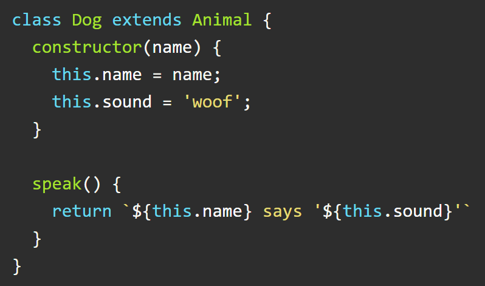
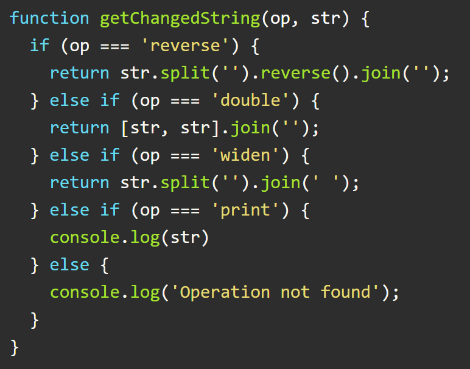

# Practice Assessment Solution

1. Which word represents the 'context' of the above class?
    - constructor
    - this `(correct)`
    - Dog
    - extends

2. Which of the following are characteristics of *inheritance*?
    - Inherited methods are used to override parent methods.
    - Inheritance is used to instantiate a clone of a parent object.
    - Inherited methods come from a parent class.  `(correct)`
    - Class inheritance is achieved in JavaScript using the keyword *extends*.  `(correct)`

3. Which of the following are characteristics of *polymorphism*?
    - It allows different classes to be using the same interface. `(correct)`
    - Its name means 'many shapes'. `(correct)`
    - It can be achieved by *overloading* methods. `(correct)`
    - It can be achieved by *inheriting* methods. `(correct)`

4. Which of the following is are methods to approach OOP design?
    - Break down the problem into logical equations ***** talk to curriculum about this one
    - Design classes with intuitive interfaces  `(correct)`
    - Eliminate unnecessary repetition with inheritance  `(correct)`
    - Label _POJO_s with intuitive keys and values

5. Which coding principle does the above code violate?
    - TDD
    - DRY
    - SRP  `(correct)`
    - OOP

6. What is a *static method*?
    - A method that is not connected to a particular object instance  `(correct)`
    - A method whose return value is always the same
    - A method that does not inherit any attributes from a parent class
    - A method that generates a new object instance
