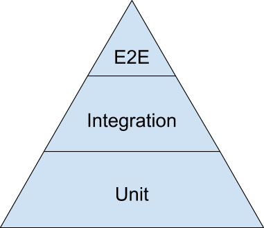
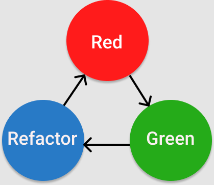

# TDD (Test Driven Development)

## Error Types
- SyntaxError - represents an error in the syntax of the code.
- ReferenceError - represents an error thrown when an invalid reference is made.
- TypeError - represents an error when a variable or parameter is not of a valid type.

## Testing

As developers, we need to test our code, but why?
- Make sure the code works as expected
- Refactor the code later or add/remove functionality
- Tests can be used to assist in creating documentation
- Tests allow you to collaborate easier

Testing Pyramid

- Unit Tests: Smallest unit of testing. Focuses on individual functions or tasks
  individually.
- Integration Tests: Testing how separate pieces of code work with one another.
- End-to-End Tests: Tests the whole application, high level functionality, close
  to the user experience.

TDD Process

- Red: Write tests, watch them fail
- Green: Write code, just enough to pass the previously written tests.
- Refactor: Write more tests, watch them fail, pass the tests. The loop of
  easily maintainable, fully tested, clean code.

[error types quiz]: https://open.appacademy.io/learn/part-time-canonical/week-8---context-and-tdd/error-types-quiz
[error handling quiz]: https://open.appacademy.io/learn/part-time-canonical/week-8---context-and-tdd/error-handling-quiz
[error handling practice]: https://open.appacademy.io/learn/part-time-canonical/week-8---context-and-tdd/practice--error-handling
[testing pyramid quiz]: https://open.appacademy.io/learn/part-time-canonical/week-8---context-and-tdd/testing-pyramid-quiz
[tdd quiz]: https://open.appacademy.io/learn/part-time-canonical/week-8---context-and-tdd/tdd-quiz
[mocha and chai quiz]: https://open.appacademy.io/learn/part-time-canonical/week-8---context-and-tdd/mocha-and-chai-quiz
[unit tests with mocha and chai practice]: https://open.appacademy.io/learn/part-time-canonical/week-8---context-and-tdd/practice--units-test-w--mocha-and-chai
