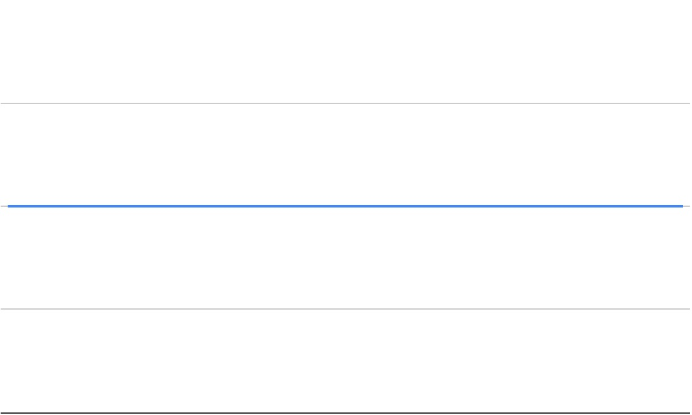
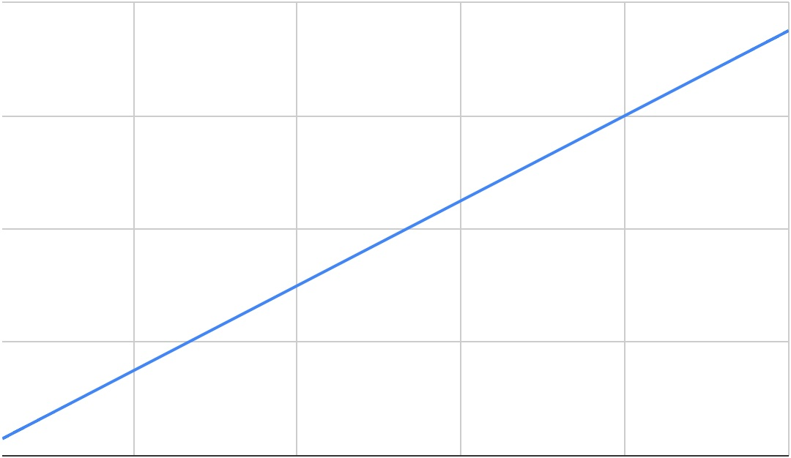
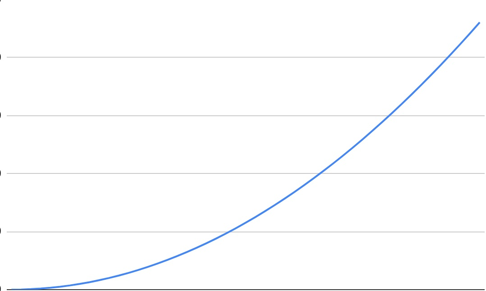

# M2-W3-D3

Timing and Big-O Notation

## Big-O Notation Basics

The biggest thing to remember when using Big-O notation (o stands for order) is that
we are not concerned with exact values, we are looking at growth curves and
worst case scenarios.

---

### Constant Growth



```js
// No matter the size of the input the time complexity remains constant.

const add = (num1, num2) => num1 + num2;
```

---

### Linear Growth



```js
// The time complexity grows linearly, directly corresponding to the size of the input.

const addToN = (n) => {
  let total = 0;

  for(let i = 1; i <= n; i++){
    total += n;
  }
  return total;
}
```

---

### Quadratic Growth



```js
// exponentially grows dependent on input.
// n*n number of times.

function printPairSums(n) {

  for (let i = 0 ; i < n ; i++) {

    for (let j = 0 ; j < n ; j++) {
      console.log(`${i} + ${j} = ${i + j}`);
    }

  }
}
```

---

### Deducing Efficiency

```js
function printTripleSums(n) {

  for (let i = 0 ; i < n ; i++) {

    for (let j = 0 ; j < n ; j++) {

      for (let k = 0 ; k < n ; k++) {
        console.log(`${i} + ${j} + ${k} = ${i + j + k}`);
      }
    }
  }
}

// What is the above codes time complexity?

function printLettersNTimes(n) {

  const letters = "abcdefghijklmnopqrstuvwxyz";

  for (let i = 0 ; i < letters.length ; i++) {

    for (let j = 0 ; j < n ; j++) {
      console.log(letters[i]);
    }
  }
}

// What is the above codes time complexity?

function printNumbersTwice(n) {

  for (let i = 0 ; i < n ; i++) {
    console.log(i);
  }

  for (let j = 0 ; j < n ; j++) {
    console.log(j);
  }
}

// What is the above codes time complexity?

function printPairSumsThenPrintNums(n) {

  for (let i = 0 ; i < n ; i++) {

    for (let j = 0 ; j < n ; j++) {
      console.log(`${i} + ${j} = ${i + j}`);
    }
  }

  for (let k = 0 ; k < n ; k++) {
    console.log(k);
  }
}

// What is the above codes time complexity?
```

---

## Practice Pt1 (20m)

## Discussion Pt1

---

## Practice Pt2 (20m)

## Discussion Pt2

---

## Practice Pt3 (20m)

## Discussion Pt3

---

## Javascript Arrays Big-O Project (Paired)
