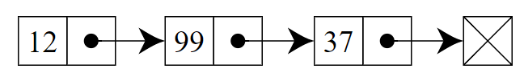
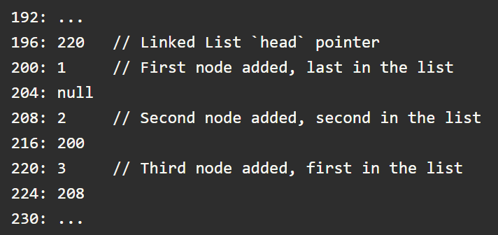

# M2W4D2

## Linked Lists



- An ordered sequence of `nodes`. Each `node` consists of a data value and a pointer to the next node in the list.

When implemented in code a node will look something like this:

```js
class LinkedListNode {
  constructor(value, next){
    this.value = value; 
    this.next = next; // pointer to the next node
  }
}
```

A classic data structure, A `linked list` is like an `array` in that `linked lists` are used to store an **ordered sequence of values**, however they take up much more space and are slower than `arrays` because they use **pointers** to store the data.

- **Pointers** allow you store complex, multi-dimensional data in a *linear memory bank*.

The first node in a `linked list` is called the `head` node. The list continues until it reaches a `null` pointer (the `tail` node). If the list is empty, the `head` pointer will be `null`.

```js
class LinkedList {
  constructor(){
    // default to empty
    this.head = null;
  }

```

Say we had 4 nodes (data values are 2,4,6,8), in order to code this we would need to create 4 `LinkedListNode` objects, and then link them together:

```js
const node4 = new LinkedListNode(8, null);
const node3 = new LinkedListNode(6, node4);
const node2 = new LinkedListNode(4, node3);
const node1 = new LinkedListNode(2, node2);

let list = new LinkedList();
list.head = node1;
```

## Linked List Demo

- check out the `linkedLists.js` file in the `Lecture` folder.

## Traversing a list

When traversing a `linked list` you can use the `head` pointer to **move through the list in order**.

```js
let currentNode = list.head;

while (currentNode) {
  console.log(currentNode.value);
  currentNode = currentNode.next; 
  // once you reach a .next that is null (the tail),
  // your currentNode will no longer be truthy and
  // you will exit the loop.
}

console.log('NULL');
```

> quick note: if you'd like to console.log several things separately, but see them all on the same line use process.stdout.write('something').

- **Traversal** is also useful for searching a `linked list`. Like iterating, you *must visit each node* in order to check the value.
- Since you must visit every node in a traversal, the time complexity is `O(n)`.

## Linked Lists in Memory



- As we can see, we have this list that is storing nodes in memory. The first node value added is `200`. it's pointer value (`204`) is null. the second node value we added (`208`) replaced the previous head (`200`). We know this because it's pointer (`216`) is pointing to `200`, so that means it comes before `200` in the list. the last node added was `220`. It's pointer (`224`) is pointing to `208` which means it is now the head of our list.

- Having our list stored this way means that **they don't have to occupy a contiguous block of memory** and the nodes can be spread out in memory as needed. (no need to worry about allocating enough memory for the list)

- The downside is that we are **using a lot more memory** than we would with an `array`. For every 1 slot in memory an `array` uses, we use 2. One for the value, one for the pointer.

- Another downside is that if you need to find a value in a `linked list` it's going to be an `O(n)` time complexity, compared to an `array` with an `O(1)` time complexity due to *indexing*, because you have to *traverse* the list to find the node you want.

- The space complexity for a `linked list` is going to be `O(n)`. The amount of data stored increases linearly with the number of nodes in the list.

## Doubly Linked Lists

A `doubly linked list` is a `linked list` with nodes that have a pointer to the previous node.

```js
class LinkedListNode {
  constructor(value, previous, next){
    this.value = value; 
    this.previous = previous; // pointer to the previous node
    this.next = next; // pointer to the next node
  }
}
```

The good thing about having a `previous` pointer is that we can insert nodes anywhere in the list. Also removing from the tail is now an `O(1)` operation.

The downsides of a `doubly linked list` are as follows:

- **Memory cost**: We are now storing an additional pointer for each node.
- **Code complexity increases**. Must update all `methods` to account for the new pointer.

## Queues

A `queue` is an ADT that returns values in the same order they are added. That means the first thing in is the first thing out. (`FIFO`) as opposed to the `stack` where the last thing in is the first thing out. (`LIFO`)

- Think of waiting in line at an amusement park. The first person in line is the first person that gets to ride the roller coaster.

There are two important functions that define a queue:
`enqueue` and `dequeue`.

- enqueue: takes in a value and adds it to the end of the queue.

- dequeue: removes the first value from the queue and returns it.

### Implementation with an array

Just like with a stack, you start with an empty array.

```js
class Queue {
  constructor() {
    this.data = [];
  }

  enqueue(value) {
    this.data.push(value);
  }

  dequeue() {
    return this.data.shift();
  }
}
```

This is pretty simple, but it's not the most efficient way to implement a queue. Since we are using `shift` to remove the first value, we have `O(n)` time complexity.

### Implementation with a linked list

```js
const LinkedList = require("./linked-list.js");

class Queue {

  constructor() {
    this.linkedList = new LinkedList();
  }

  enqueue(value) {
    this.linkedList.addToTail(value);
  }

  dequeue() {
    const value = this.linkedList.head.value;
    this.linkedList.removeFromHead();

    return value;
  }
}
```

Since even with a Singly Linked List, we are using `O(1)` time complexity for `addToTail` and `removeFromHead`, we can improve our time complexity to `O(1)`!

Both implementations have their merits. Using an `array` is much less complex than using a `linked list`. However, the `linked list` is *more time efficient* if you're dealing with very large input. If your input is small (1000 is small to a computer), you may want to use an `array` to keep the code *simple and readable*.

## Project Time

- [Linked List Practice Pt1](https://open.appacademy.io/learn/js-py---pt-may-2022-online/week-10---data-structures/linked-list-practice-part-1) (25m)
- Part 1 Discussion (20m)
- [Linked List Practice Pt2](https://open.appacademy.io/learn/js-py---pt-may-2022-online/week-10---data-structures/linked-list-practice-part-2) (25m)
- Part 2 Discussion (20m)
- [Linked List Practice Pt3](https://open.appacademy.io/learn/js-py---pt-may-2022-online/week-10---data-structures/linked-list-practice-part-3) (25m)
- Part 3 Discussion (20m)

If we finish early, please get started on your homework for Wednesday!
