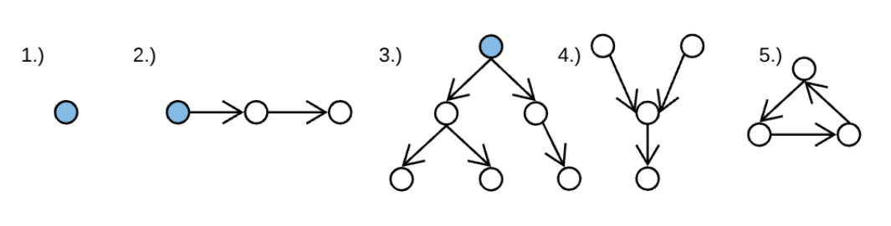

# M2W5D2

## `Trees and Graphs`

`Trees` are a common data structure in computer science. You can think of them like a `singly-linked list`, except instead of having a single `.next` node, each node has one or more `child` nodes.

### `Graphs`

A `graph` is a collection of nodes and edges between those nodes. Each circle is a node and each arrow is an edge.



- In the picture above, examples 1 and 2 are both considered to be a `graph`, a `tree`, and a `linked list`.
- Example 3 is a `graph` and a `tree`, but not a `linked list` because it has nodes with more than 1 child node.
- Example 4 is a `graph`, but it's not a `linked list` or a `tree` because it has nodes with more than one parent.
- Example 5 is a `graph`, but it's not a `linked list` or a `tree` because it has a cycle.

### `Trees`

A `tree` is a `graph` with no cycles. A cycle is a path that starts and ends at the same node.

Looking at the above example, the blue circles are the `'root'` nodes. These are usually shown at the top of the `tree`. Just like the `head node` in a `linked list`, if you want to reference a `tree`, you can just pass the `root` node, and will have access to every item in that `tree` through that node.

## `Binary Trees`

A `Binary tree` is a tree where the nodes have 
**at most** 2 children. This means that examples 1, 2, and 3 are all `Binary Trees`. 

- An empty `graph` of 0 nodes and 0 edges is technically a `binary tree`.
- A `graph` of 1 node and 0 edges is a `binary tree`.
- a `linked list` is a `binary tree`.

### `Binary trees in code`

As said before, a `tree` is just a collection of nodes, so first you would need a `treeNode` class.

```js
class TreeNode {
  constructor(val) {
    this.val = val;
    this.left = null;
    this.right = null;
  }
}

const a = new TreeNode('a');
const b = new TreeNode('b');
const c = new TreeNode('c');

a.left = b;
a.right = c;

//     a
//    / \
//   b   c
```

Constructing a `tree` is just a matter of creating the nodes and setting the `.left` and `.right` to point to other nodes. `Trees` will only traverse in one direction, so `a` can access `b`, but `b` can't access `a`.

## `Tree Traversal`

### `Searching`

If your `Binary Tree` is not ordered, you'll have to traverse the entire tree to search for a value. If we were to do this recursively, the pseudocode would look like this:

- Base case: If the tree is null, return false
- If the current node's value equals the target, return true
- Otherwise, search the left subtree for the target
- If the value isn't in the left subtree, try the right subtree

## `Binary Search Trees`

In order for a `Binary Search` to work, the tree data must be sorted.

In an `array`, the data can be sorted in `LogLinear O(n log n)` time, which is just a tiny bit less efficent than `Linear O(n)` time, however when adding things to a sorted `array`, you must find the correct place to insert the new value so insertion is `Linear O(n)` time.

`BSTs` or `Binary Search Trees` are similar to a `doubly linked list`, and allow for the same `Logarithmic O(log n)` time for searching as a sorted `array`, but with `O(log n)` insertion and deletion as well!

### `Properties of BSTs`

The key difference that makes a `Binary Search Tree` different from a `Binary Tree` is that the `Binary Search Tree` is sorted. Every node on the **left will be less** than the value of its `parent`, and every node on the **right will be greater** than the value of its `parent`. (if the value is the same for both, the duplicate is usually placed on the right side of the `parent`.)

- All `Binary Search Trees` are `Binary Trees`, but not all `Binary Trees` are `Binary Search Trees`.

In order to search a `BST`, your psuedo-code would look like this:

- If the `root` node is `null`, return false
- If the `root` node's value equals the `target`, return true.
- If the `target` is less than the `root` value, recursively search the left `subtree`
- If the `target` is greater than the `root` value, recursively search the right `subtree`

This can be done iteratively as well using a while loop.

### `Time complexity of searching a BST`

Each comparison in a `BST` moves down by one level, so the worst-case time complexity is equal to the height of the tree. The height is equal to `O(log n)`.
- Everytime you move down a level on either side of the tree, the number of values to search is cut in half.

### `Inserting and Deleting`

#### `Inserting`

- Determine if the value is less than or greater than the root.
- If the value is less than the root, move to the left and compare with that node's value, if not move to the right and repeat the process until you find the correct place to insert the value.

#### `Deleting`

- If the node is a leaf, simply delete it from the .left or .right of the parent.
- If the node has one child, replace the node with that child.
- If the node has two children, find the smallest value in the right subtree of that node and replace the node's value with that value or the largest value in the left subtree and replace the node's value with that value.

```js
//     d
//   /   \
//  b     f
// / \   / \
//a   c e   g
```

So to replace `d` we could either move our `c` to be the root, or we could move our `e`.

### `Balancing`

If you start with the lowest number and always add a greater number your tree could end up looking something like this:

```js
//    1
//     \
//      2
//       \
//        3
//         \
//          4
```

This is a valid tree, but it's unbalanced and inefficient. This tree would have a search time of O(n) because it has to traverse the entire tree to find the value.

Balancing a tree is a heavy topic and can be researched on your own since we won't be covering that in this course.

- [Red-Black Tree](https://en.wikipedia.org/wiki/Red%E2%80%93black_tree)
- [AVL Tree](https://en.wikipedia.org/wiki/AVL_tree)
- [B-Tree](https://en.wikipedia.org/wiki/B-tree)

## Tree Demo

## Project Time

[Binary Search Tree Practice Part 1](https://open.appacademy.io/learn/js-py---pt-may-2022-online/week-11---binary-search-and-trees/binary-search-tree-practice-part-1) (20m)

Discussion part 1

[Binary Search Tree Practice Part 2](https://open.appacademy.io/learn/js-py---pt-may-2022-online/week-11---binary-search-and-trees/binary-search-tree-practice-part-2) (20m)

Discussion part 2

Please do not move on to the next phases until after lecture tomorrow. We will be discussing those concepts then.

- If we have extra time after the project, please research Binary Search Trees and how to implement them in your code.
- If you would like to get a head-start on tomorrows content, please research depth-first search and breadth-first search.
