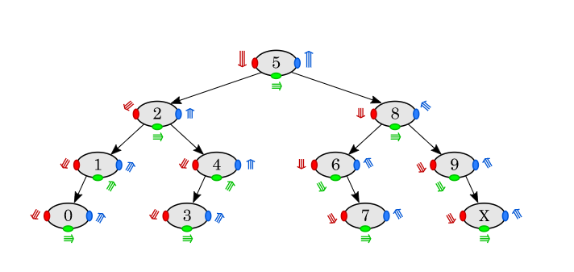

# Traversals Explained In-Depth (hopefully lol)

Say we just wanted to console.log every node.value in this tree.

## `Pre-Order traversal: root, left, right`

### (`red`)

- With this method, we start with a currentNode that is the root of the tree. We will console.log the currentNode.value (5), then we will reassign that current node to be the currentNode.left (2). Then we will repeat the process until there is no longer a .left. After this part is finished the logs will be:

5, 2, 1, 0, ...?

- then we will work our way back up the tree from 0 looking for a node that has a .right. We will get back up to 2 and see that it has a node on the .right. We will reassign our currentNode to be 4, console.log 4, then work our way down the left of that subtree. (imagine 4 is the root of its own tree). we will console.log the 3, then since there are no more lefts we will check for .rights on our way back to 4. Since there are no more rights from there we will work our way back up to the root. When this part is finished the order will be:

5, 2, 1, 0, 4, 3, ...?

- Once we get back to the root, we know we have finished logging all of the .lefts, and we will move to the .right of the root. We will reassign our currentNode to be 8, console.log 8, then work our way down the left of that subtree console.logging each element as we go. Once we reach 7, we will work our way back up to 8 and start console.logging everything on the right side of that node. When we finish this phase, our final console.logs will be:

5, 2, 1, 0, 4, 3, 8, 6, 7, 9, x

## `In-Order traversal: left, root, right`

### (`green`)

- With this method, we see that we are console.logging the left most node first, then the currentNode, then the right most node. To start, our currentNode will be the root, 5. We will check if it has a .left. It does (2). Before we reassigning our currentNode to be 2, we want to see if 2 has any .left children. If it doesnt, our current node stays at 5. Since 2 does have a .left child we reassign our current node to be 2, and repeat the process with it's children until we travel all the way to the bottom most left parent node and start there.

- We will start with our current node being 1. Our current node will never be 0 because 0 doesn't have any children. We console.log our .left first (0) then the current node (1), then check if there is a .right. If there is a .right, we will move to the right and start the process again. There isn't on the 1, so we move back to 2. Now that all of the nodes on the .left of the 2 have been logged, we can log the 2 and work our way down it's right subtree. We make our currentNode 4, and we would check to see if it has .left children. It does, and they dont have any children, so we will console.log the .left (3) and then the current (4) then check if there is a .right, there isn't so we work our way up the tree to get back to the root. At the end of the left subtree our logs will be:

0, 1, 2, 3, 4, ...?

- Now that we are at the root and it's been reassigned to be our currentNode, we have already console.logged it's .lefts. So we will console.log the root (5) and move to the right and make 8 our currentNode. Then we repeat the process. Travel down to the bottom most left parent node (6) and console.log its .left if there is one (there isn't) then the node itself (6) then it's right child (7) and work our way back up to 8, and now it's .lefts are all complete so we log 8 and do the right side of the 8. When we finish this phase, our final console.logs will be:

0, 1, 2, 3, 4, 5, 6, 7, 8, 9, x

## `Post-Order traversal: left, right, root`

### (`blue`)

- With this method, we want to find the bottom most left parent node to start (1) and console.log its .left first (0), then it's .right (nothing there) then the node itself (1). then we move up to 1's parent (2) and look for the .right of that one. If that .right has a .left that has children, we will move to the bottom and repeat. Since the .right of 2 is 4, and 4 only has a .left of 3 with no children, we will log our .left (3) then check for a .right (nothing there) then log the node itself (4). then when we have finished with the right subtree of 2, we move back to the 2 and log it before moving back up to the root(5). When we finish this phase, our final console.logs will be:

0, 1, 3, 4, 2, ...?

- Now that we have logged all of the left subtree of 5, we move to the .right subtree and repeat the process. Our current node becomes 8 and we check if it has a .left. It does (6). Since 6 has no .left, we will check it's .right and since that node is a leaf (7) we will log it, then move back and log the 6, before going back to 8. Now that we have logged the entire left subtree of 8, we move to the right and repeat the process. 9 doesn't have a .left, and it's .right is a leaf, so we log that (x) and then log 9 and move back to the 8. We have completed both subtrees of 8, so we log 8 and now the right subtree of our root (5) is complete and we log it. When we finish this phase, our final console.logs will be:

0, 1, 3, 4, 2, 7, 6, x, 9, 8, 5
