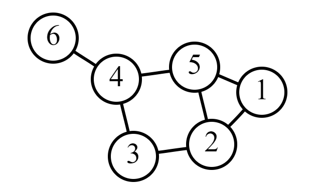

# **`Traversals`**

## `Breadth-First Graph Traversal`

**Traversal** is a little different with `graphs` than with `trees`.

- traverse `nodes` from nearest to furthest (still going level by level)
- must keep track of visited `nodes` to prevent infinite loops with `cycles`

Using this example, we would start at `1`, visit `5` and `2` in any order and add their children, visit `3` and `4` in any order and add their children and then visit `6`. `Levels` are still determined by `edges`, so there are 3 to this graph.

> It is recommended to memorize the breadth-first traversal algorithm.

**Pseudocode**:

1. Create a `queue` and `enqueue` the starting `node`
2. Create a `set` to store visited `nodes`

- While the `queue` is not empty:

    1. `Dequeue` a `node` from the `queue`
    2. Do what you need to do to the `node`
    3. Check if the `node`'s neighbors have been visited:
        1. Add the unvisited neighbors to the `set` of visited `nodes`
        2. `Enqueue` all of the unvisited neighbors

### `Depth-First Graph Traversal`

- traverse `nodes` through unvisited neighbors until you reach a `node` without one
- backtrack and find the nearest unvisited neighbor and continue from there

Using this example, there are many different paths we could take. We could start at `1`, visit `2`, then `3`, then `4`, then `6`, then we would have to backtrack and visit `5`.

**Pseudocode**:

1. Create a `stack` and `push` the starting `node`
2. Create a `set` to store visited `nodes`

- While the `stack` is not empty:

    1. `Pop` a `node` from the `stack`
    2. Do what you need to do to the `node`
    3. Check if the `node`'s neighbors have been visited:
        1. Add the unvisited neighbors to the `set` of visited `nodes`
        2. `Push` all of the unvisited neighbors

The process is virtually the same but the order will be very different because of the `stack` vs `queue`.

### `Finding the shortest Path`

Breadth-first searches are great for finding **a** shortest path. There may be more than one valid solution.

**Psuedocode**:

1. Create a `queue`
2. Create a separate `array` containing the starting `node` and `enqueue` that `array`. (**this is the path we're currently on**)
3. Create a `set` to store visited `nodes`

- While the `queue` is not empty:
    1. `Dequeue` the first path and save it to a variable
    2. Save the last `node` in the path to a variable (**DO NOT POP IT**)
    3. Is this `node` the end `node`?
        1. If so, return the path
    4. Else for each unvisited neightbor of the last `node`
        1. Add to the `set` of visited `nodes`
        2. **Copy** the saved path and `push` this neighbor into the copy.
        3. `Enqueue` the new path
    5. If the `queue` is empty, return (false, an error, null, whatever you need to return)

### `Time and Space Complexity of Graph Traversals`

#### `Time`

Assuming you're using a `set` for visited `nodes` and appropriate `stacks` and `queues`, the time complexity of both the Breadth and Depth-first searches (traversals) is `O(n)`.

#### `Space`

In a worst case scenario, the space complexity of a `graph` traversal is also `O(n)` (for the `stack` or `queue`). The `set` will have a space complexity of `O(n)` at the end as well, but since we know we drop the constants when simpligying O(2n) is the same as `O(n)`.
