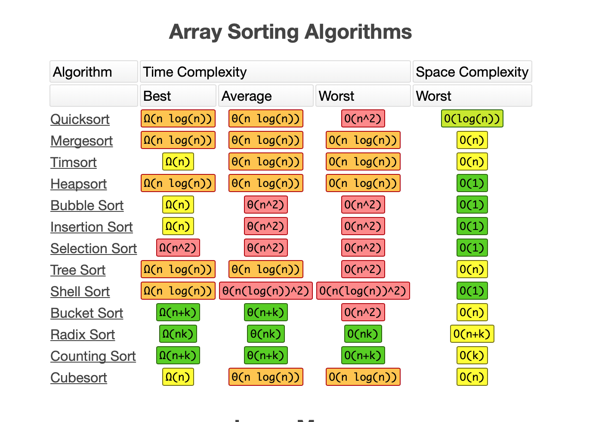

- Understand the basics of JavaScript's built in `sort` function and how the comparison callback function works
- Different sorting algorithms
  - Bubble
    - Swapping adjacent pairs until array is sorted
  - Insertion
    - Values chosen randomly to be placed in the correct spot in a sorted array
  - Selection
    - Selecting the smallest value and sorting it until array is sorted
  - Quicksort
    - Divides an array around a pivot then sort the left and right sides
  - Mergesort
    - Divides an array in half, sorts each half, then recombines the halves together in order
- Difference between binary tree and binary search tree
- Graph concepts, terminologies, and traversals like BFT, DFT, and which traversal will yield us the shortest path.

- Coding Portion
  - Be able to work with a 2d matrix that represents the graph 
  - Be able to `read mocha spec files for more context`
  - Build a neighbor finder, graph traversal, and apply it to solve a problem
  - Understand the 3 principle of solving graphs
    - `Identify graph type`: and define the type of graph
    - `getNeighbors function`: how to implement this to get the neighbors of a given node from a graph
    - `Traverse graph`: BFT/DFT and do the thing.
  - Recommended projects
    - `Solving graph problems`
    - `Practice assessment`
    - Basic `breadth/depth first traversal`

