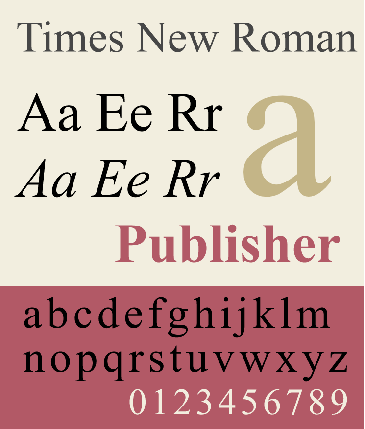
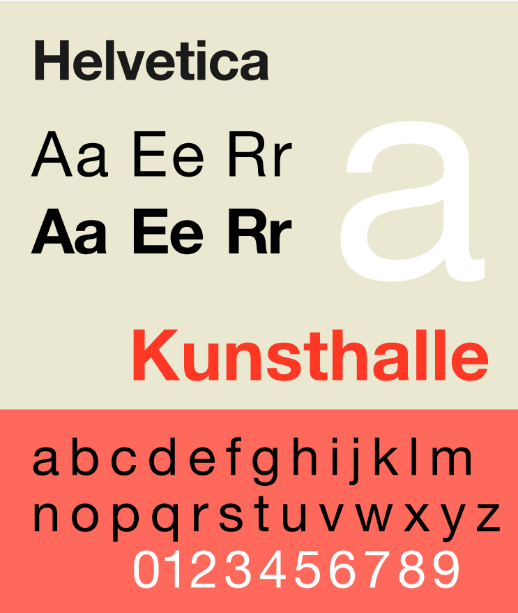

# `M3W1D1`

## `Assessment Break Down`

- Length: `1hr 55m`
- **`MCQ - 7 points`**
- **`Coding Challenge - 12 points`**

- Passing score **`16/19`**

- **Remember not to spend too much time on one thing, if you get stuck for more than 15m on something move on and finish everything else, then come back to it.**

- **`You have access to the following resources during your test`**

  - `aA open`
    - including homework
    - problems you did
    - REPL (to run code)
  - `MDN`
  - `any code you have written` *outside of code from previous assessments*. (**`Practice Assessments are okay to reference!`**)
  - `US!` (*to clarify and explain question*)
  - `VSCode`

  You are **not** permitted to use:

  - **`Google`**
  - **`Notes`**
  - **`PREVIOUS ASSESSMENTS ARE NOT ALLOWED`**
  - **`anything not in the listed resources`**

### This is the last assessment for Mod 2! You guys have got this! 🙂

---

After you're finished with your test, please look at todays content and do the readings. We will not be pairing for this. We will have a brief lecture, then you can do your exercises. There will not be discussions after each exercise.

## `Design and Accessibility`

### **`Design`**

[Dieter Rams](https://en.wikipedia.org/wiki/Dieter_Rams)'s 10 principles for good design:

Good design:

- is innovative
- makes a product useful
- is aesthetic
- makes a product understandable
- is unobtrusive
- is honest
- is long-lasting
- is thorough down to the last detail
- is environmentally friendly
- is minimal

**This is `not` a design course, however we will include a few design principles to keep in mind when building websites.**

- `White Space`
  - Leaving empty space around text, images, and interactive elements is a good way to keep things looking clean and increase legibility and usability.
- `Colors`
  - Color should be used to convey meaning and to make the content easy to read.
  - Your colors should complement each other, not clash.
  - Use something like the [Adobe color wheel](https://color.adobe.com/create/color-wheel) or [Google's Material Design Docs](https://material.io/design/color/the-color-system.html) to help you choose.
  - Your colors should be easily distinguishable, even for the color blind. You can use the [color-blindness simulator](https://www.color-blindness.com/coblis-color-blindness-simulator/) to help you decide what colors to use.
- `Typography`
  - Choosing readable fonts is very important!
  - Two types of fonts are important:
    - `Serif`
      - Serif's are the small strokes on the ends of letters in fonts like Times New Roman, Palatino, and Georgia.
      - Improve readibility of text blocks, used in newspapers and early books.
      - still used to improve long-form readability.
      
    - `Sans-serif`
      - These have no serifs. They are minimal and clean, examples include Helvetica, Arial, and Verdana.
      - Ideal for single words or short-form phrases like headlines, icons, and navigation.
      - Usually used with larger text size.
      

### **`Accessibility`**

- *`Accessibility is a big part of the design process`*
- use the [Web Content Accessibility Guidelines](https://www.w3.org/TR/WCAG21/) to ensure that your website is accessible to everyone.

The `four principles of WCAG` 2.1 are:

- `Perceivable`
  - HTML is structure in a way that reflects a heierarchy, sequence or relationships.
  - Color is used to convey meaning.
  - Avoid using images of text, since they can't be read by screenreaders.
- `Operable`
  - The user can perform all operations using a keyboard.
  - All nav links should be clearly labeled.
  - Targets for user interaction are large enough to be user friendly.
- `Understandable`
  - Web page specifies its language
  - Clear error messages
  - Predictable nav patterns
- `Robust`
  - All elements have unique IDs
  - All HTML syntax is correct with appropriate nesting and opening and closing tags.

You can use this [Accessibility Checker](https://www.accessibilitychecker.org/) to determine the accessibility of different websites.

**You're not expected to be come an accessibility expert here**. Most of the time your company will work with a UI/UX designer that will help with accessibility.

### `Project Time`

[Design Principles](https://open.appacademy.io/learn/js-py---pt-may-2022-online/week-13---html-and-css/exercise--design-principles)

[Accessibility](https://open.appacademy.io/learn/js-py---pt-may-2022-online/week-13---html-and-css/exercise--accessibility)

Once you finish today's content, please get started on your homework.
