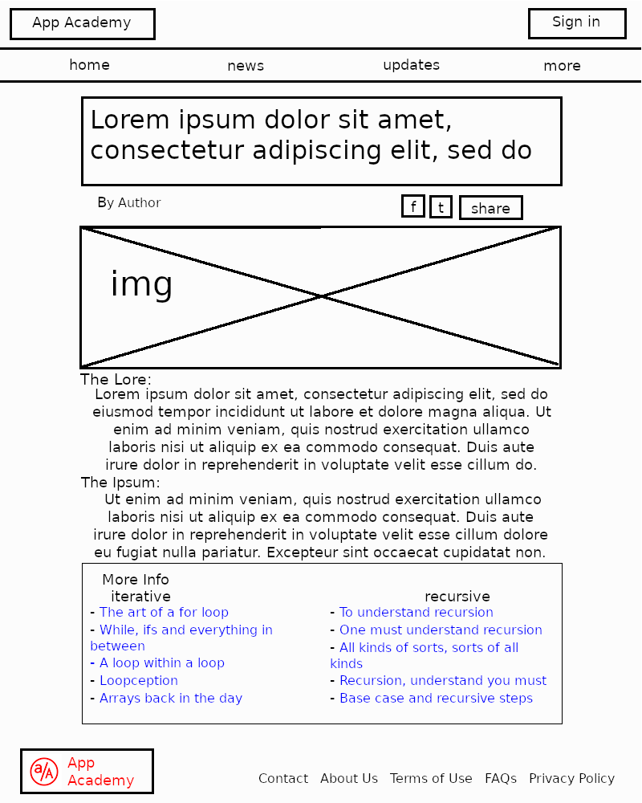

# M3-W1-D2

## Website Building Blocks

- HTML: Provides structure and layout.
- CSS: Provides look, feel, and positioning.
- JavaScript: Provides interactivity and complex functionality.

**Today** we will be focusing on pure HTML.

**Tomorrow** we will start adding in CSS.

**Later** we will reintroduce JavaScript in the context of the browser.

## Wireframes and HTML Intro

---

### Basic HTML Demo

---

### Following a Wireframe Demo

---

## HTML from Wireframes Long Practice

If you finish this project and have time left over, feel free to look at
tonights homework and start styling the page you have worked on.

---
