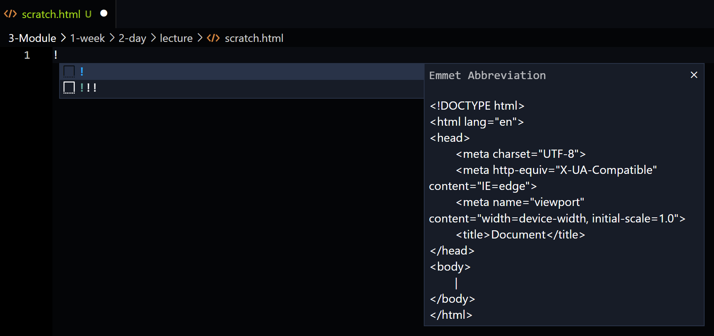
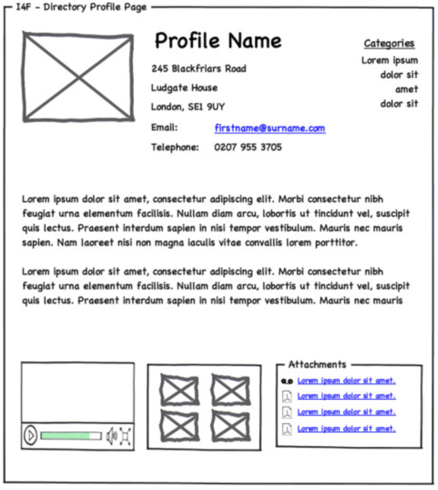
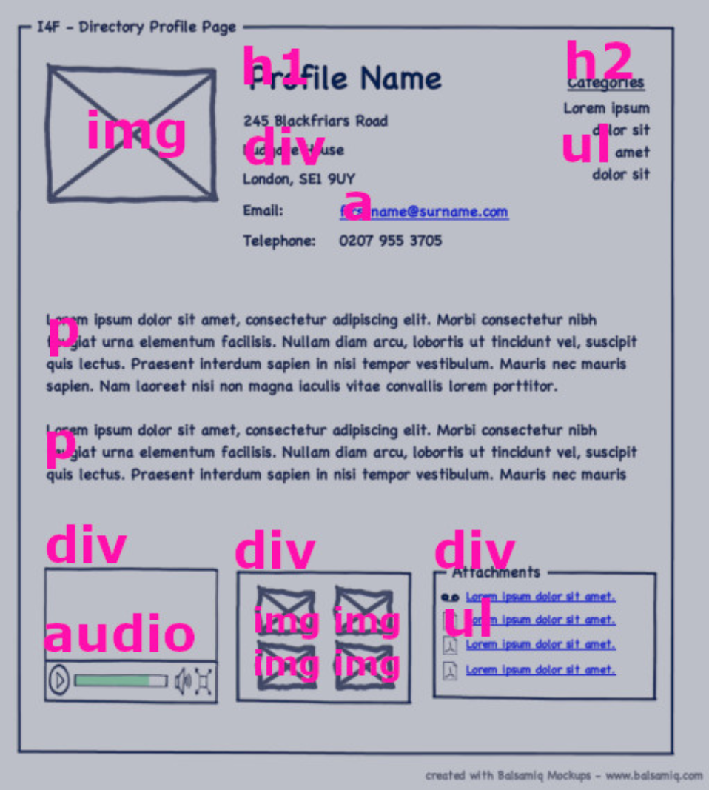

# `M3W1D2`

> To research specific `HTML` `elements` or `attributes` or `CSS` `properties`, use the [HTML Landing Page](https://developer.mozilla.org/en-US/docs/Web/HTML) and [CSS Landing Page](https://developer.mozilla.org/en-US/docs/Web/css) on `MDN` as a reference. They've got everything you need to know, and will give you an edge in this mod! I **highly recommend you bookmark these pages** and use them frequently while doing your practices.

## `VsCode Live Server`

The live server is a way to view your `HTML` doc in your browser while you're coding. It has a feature called *hot reload* that will reload your page when you make a change and save your file! Super useful!

- in `vsCode extensions` tab search `live` and download:
  - `live server` extension

    

---

## `HTML`

HTML stands for HyperText Markup Language.

There are 3 components that form the basic building blocks of HTML.

### `Tags`

- A `tag` is a piece of code that tells a browser how to render a certain element.
- Any text that you write inside the angle brackets (`<` and `>`) will not be displayed in the browser.
- **`MUST ALWAYS USE ANGLE BRACKETS FOR TAGS`**
- `Tags` almost *always* come in pairs. This means you must have a `closing tag` for every `opening tag`. (**there are a couple of exceptions**)
- For consistency and clarity, you should *use lowercase letters* for `tags`. (don't capitalize them)
- For almost all `tags`, you will have an `opening tag` and a `closing tag`. The `closing tag` will be the same as the `opening tag`, but with a `/` at the beginning.

  ```html
  <!-- I'm a comment in HTML. -->
  <!-- The only thing that will be rendered to the page is the text between the tags. The tags just tell the browser how the text should appear.-->
  <h1>Journal Entry</h1> 
  <!--H1 tags are a header and the text will be large and bold-->
  <p>My son played fetch with his new puppy this morning, it was so adorable. I really want to get a new car. I need to make more time for meditation.</p> 
  <!--P tags are for paragraphs and the text will be normal-->
  ```

### `Elements`

- An `element` consists of an opening `tag`, the closing `tag`, and any content between the `tags`.
- If a `tag` doesn't have a closing `tag` the element is just the `tag` itself.

  ```html
  <h1>Journal Entry</h1>
  <!-- The HTML element here is everything from the opening h1 tag to the closing h1 tag. -->

  
  <!-- Since an image is an 'empty tag' (a tag without a closing tag) the HTML element is everything from . -->
  ```

### `Attributes`

- used to define additional info about an `element`.
- located insde the **`opening tag`** and usually come in name/value pairs. (name='value')
- All `elements` can have `attributes`, but we only use them when we need to.
- All `elements` have *`class`* and *`id`* `attributes` that you can use to categorize and identify the `elements` in your `HTML` doc. (these are most commonly used for styling with `CSS`)
- **Should only be lowercase letters**.
- The value of the `attribute` should be enclosed in **double quotes**. (will work with single, but double is convention.)

  ```html
  
  <!-- Using the previous img example, all img tags will have a src attribute and the value will be the location of the image you want to display. -->

  <!-- The general way an HTML element should look is as follows. -->
  <closeabletag attribute="value">Some content</closeabletag>
  <noclosetag attribute="value">
  ```

When a browser is parsing an `HTML` doc, it ignores whitespace like line breaks, and those between the `tag` name and it's `attributes`, this is called **Negligible Whitespace**. See the MDN docs on [Whitespace](https://developer.mozilla.org/en-US/docs/Web/API/Document_Object_Model/Whitespace) for more info.

- You cannot have a space between the opening angle bracket (`<`) and the tag name.

  ```html
  < img src="./images/baby-bess-bouncing-backwards.jpg">
  <!-- This is not valid HTML. -->
  ```

VSCode has a shortcut to quickly create a new `HTML` doc template. Just open a new `.html` file and type '!' then press enter. Test this in scratch.html! (If you don't see it, try updating your VSCode. (go to Help -> Update VSCode))

  

---

## `Wireframes`

- Lightweight, rapidly developed design specs that **outline the structure and layout** of a web page.

Webpages are comprised of **3 major components**.

- `HTML`: Page structure, layout
- `CSS`: Styling and positioning
- `JavaScript`: Behavior and interaction

### `Reading wireframes`

Wireframes are a rough representation of the layout of a web page.




- to see an example of the `HTML` for this wireframe, see the `profile.html` file in the lecture folder.

When looking at a wireframe, you'll determine the `elements` needed to create it in your `HTML` doc, then write the `HTML` code.

**Important**:

- **Not everything goes in a `<div>` `tag`**. Try to choose the most appropriate `tag` for the element.
- Think of the `<div>` `tag` as a section and group items within.
- `Classes` are used to style `elements`. In the `profile.html` example we have a `ul` `element` with many `li` `elements` nested inside of it. We can style all of the `li` `elements` with one CSS rule if they all have the same `class` name.

## `Project Time`

You might want to use this [list of HTML elements](https://developer.mozilla.org/en-US/docs/Web/HTML/Element) as a reference when doing this project.

[HTML from Wireframes](https://open.appacademy.io/learn/js-py---pt-may-2022-online/week-13---html-and-css/html-from-wireframes-long-practice) (2h)

If you finish your project early, please get a headstart on your homework!
