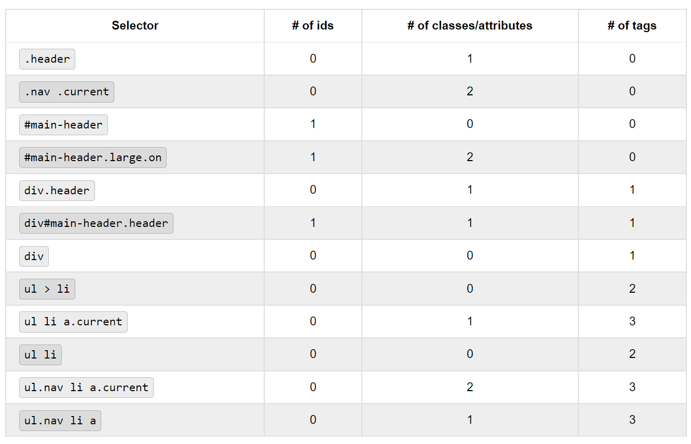

# `M3W1D3`

## `CSS`

To add an external stylesheet, you just need to link it in the `<head>` of your `HTML` doc.

```html
<head>
    <!-- -------------Header and Document Metadata!----------------- -->
    <meta charset="UTF-8">
    <meta http-equiv="X-UA-Compatible" content="IE=edge">
    <meta name="viewport" content="w`id`th=device-w`id`th, initial-scale=1.0">
    <title>Document</title>
    <link rel="stylesheet" href="./css-scratch.css">
    <!-- it doesn't matter what order these things are in, but adding this link will connect your `css` file. Use the relative path to your `css` file. (don't forget ./ is to look in your current directory and ../ is to move up a level.) -->
</head>
```

> You can add many stylesheets at the same time by linking them all or by importing them all to a single `CSS` file and linking that one.

---

## `CSS Selectors`

See [this file](./lecture/cssSelectors.md) in the lecture folder.

## `CSS Type, Properties and Imports`

See [this file](./lecture/typesPropsImports.md) in the lecture folder.

## `CSS Rules`

A rule is the combination of a `selector` and a style.

```css
div {
    color: red;
}
/* from div to the closing brace, this is a rule. */
```

### `Specificity`

The rules of priority are:

- inline writes over everything... but we rarely want this. Avoid this.
- whichever has the most `IDs`, wins.
- if above equal, whichever has the most `classes`, `pseudo-classes`, and `attributes` wins.
- if above equal, whichever has the most `tags` (`a`, `div`, `h1`, etc.) wins.
- if above equal, whichever is added last in the file wins.

> **Inline styling is bad practice and should be avoided.**

Here are some examples and how they would be applied.

  
  

---

## `Project Time`
