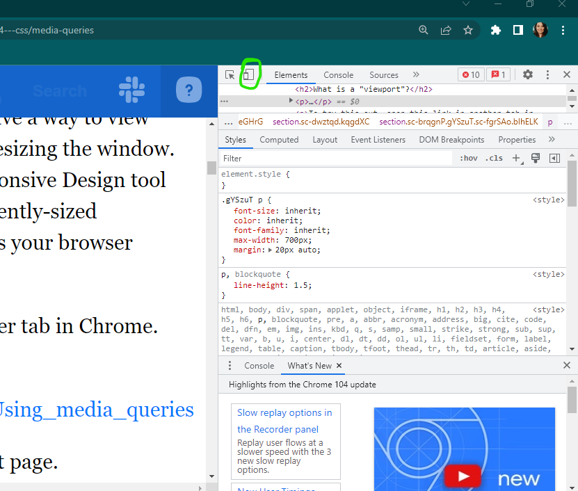
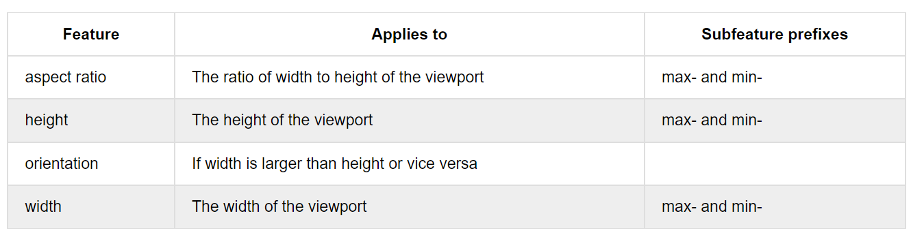

# `M3W2D2`

> Helpful Links<br>
[Using Media Queries](https://developer.mozilla.org/en-US/docs/Web/CSS/Media_Queries/Using_media_queries)<br>
[Standard Device Media Queries](https://css-tricks.com/snippets/css/media-queries-for-standard-devices/)

## `Media Queries`

Used to help us design our websites for different sized `viewports`.

- A `viewport` is the area in which the user is rendering the content of the `HTML` with the `CSS` applied to it.

Check out the **`Responsive Design tool`** in the dev tools!



### `Using Media Queries`

- Begin with `@media` 
- specify the *`medium`* or `Media Type` you want to target
- include a condition that **must be met before that rule will be applied** (the `media feature`).

### `Media Types`

- `all` refers to all devices which is the default.
- `print` applies to the layout of the document when a person intends to print it.
- `screen` applies to the layout of the doc when a browser displays it
- `speech` refers to when a screen reader reads the content.

### `Media Features`

- The characteristics of a browser or other rendering environment



```css
@media (min-width: 1600px){
  body {
    font-size: 18px;
  }
}
/* the above rule will apply to all media types anytime the screen is 1600 px or greater in width. */

@media screen and (max-width: 360px) {
  body {
    font-size: 10px;
  }
}
/* the above rule will apply only to screens anytime the screen is 360px wide or less. */

@media (orientation: landscape) {
  flex-direction: row;
}

@media (orientation: portrait) {
  flex-direction: column;
}

/* Can determine the layout of your elements based on orientation! */

```

- You can also use the css Boolean AND and OR (,) operators.

```css
@media (min-width: 301px) and (max-width: 600px) {
  html {
    background-color: #333333;
    color: white;
  }
}

@media (max-width: 300px), (min-width: 601px) {
  html {
    background-color: white;
    color: #333333;
  }
}
```

- Also have the `not` operator for negative conditions, but it can only be used to negate an entire `media query`.

## `Projects`

[FlexBox Model](https://open.appacademy.io/learn/js-py---pt-may-2022-online/week-14---css/practice--css-flexible-box-model) (30m)

- Walkthru 1

[CSS Media Queries](https://open.appacademy.io/learn/js-py---pt-may-2022-online/week-14---css/practice--css-media-queries) (30m)

- Walkthru 2

[Recreate Trello (flexbox)](https://open.appacademy.io/learn/js-py---pt-may-2022-online/week-14---css/recreate-trello-long-practice)

[Media Queries](https://open.appacademy.io/learn/js-py---pt-may-2022-online/week-14---css/media-queries-long-practice)

- Walkthru of Media Queries 30m before class ends.

> `If you finish early, please get started on homework!`
