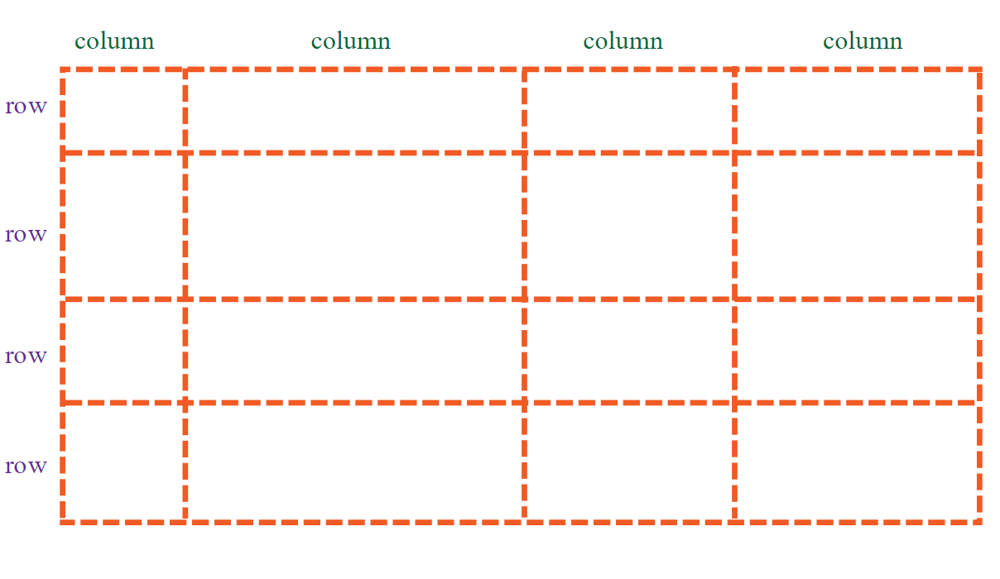
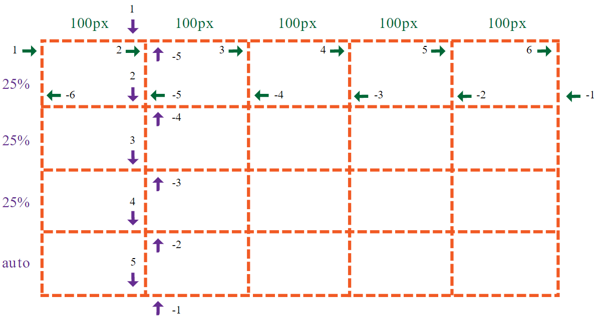
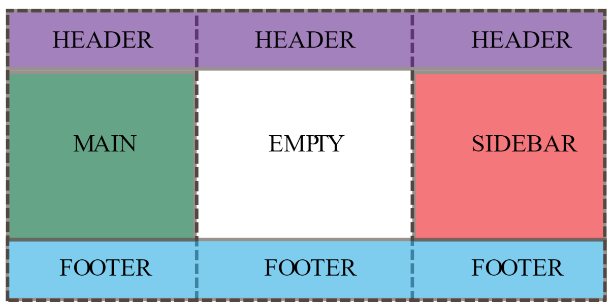
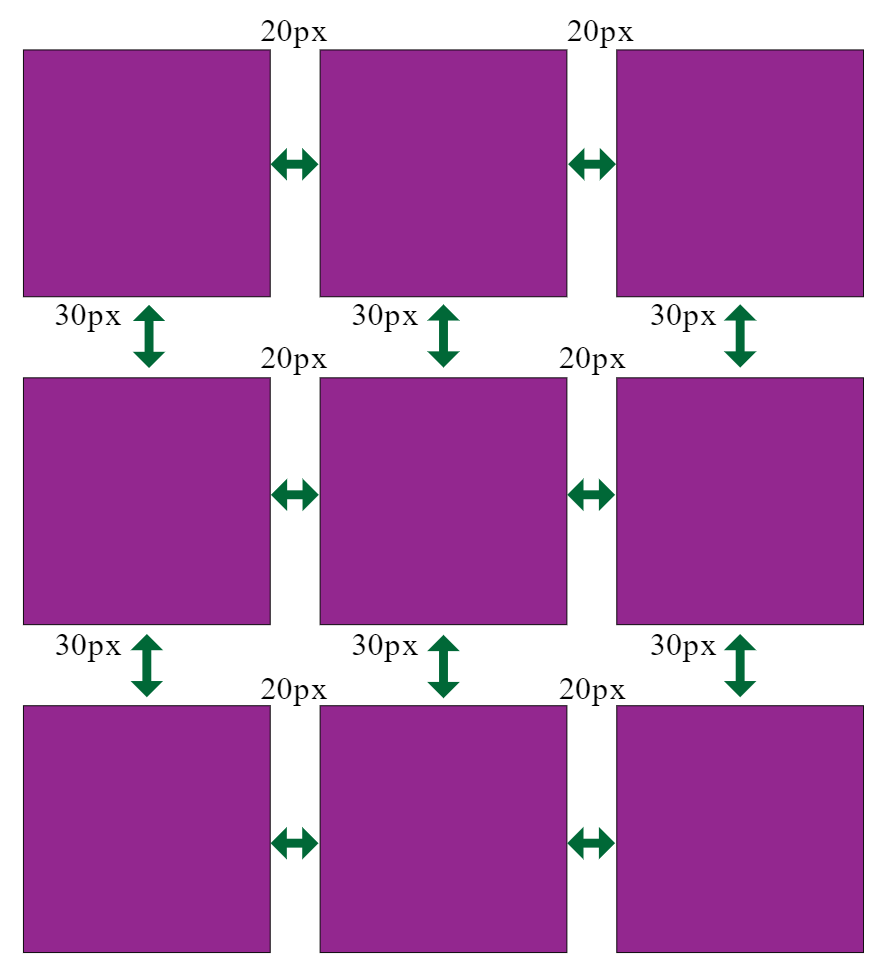

# `M3W2D3`

> ## `Helpful Links` <br>
> [Complete Guide to Grid](https://css-tricks.com/snippets/css/complete-guide-grid/) <br>
[MDN CSS Grid Layout](https://developer.mozilla.org/en-US/docs/Web/CSS/CSS_Grid_Layout) <br>
[CSS Grid Garden Game](http://cssgridgarden.com/)

## `CSS Grid`

- A two-d layout system to create a `grid` with columns and rows in `CSS`.
- Allows you to control the entire page layout
- can add as many columns and rows as you want



A `Grid` layout consists of `CSS` styles applied to:

- A `grid` container (parent `element`)
- `grid` items (children `elements`)

### `Grid container`

- use `display:grid` on the parent element
  - behaves as a block element and takes full width of parent
  - inline-grid will flow on the same line with other inline elements

### `Columns and rows`

- use `grid-template-rows` and `grid-template-columns` to set the number of rows and columns in a `grid`.
- values refer to size and can be `px`, `%,` `fractions` (using `fr`), or `auto` which expands and shrinks depending on content.
- can use `repeat()` to quickly create even rows and columns.
- can combine `px`, `%,` and `fr` to customize your layout

```css
.grid-container {
  display: grid;
  grid-template-columns: 100px 100px 100px 100px 100px;
  grid-template-rows: 25% 25% 25% auto;
}

/* using repeat */
.grid-container {
  display: grid;
  grid-template-columns: repeat(5, 100px);
  grid-template-rows: repeat(4, 25%);
}

/* combine units of measure to customize */
.grid-container {
  display: grid;
  grid-template-columns: 12% 200px auto 400px;
  grid-template-rows: 50px 2fr 2fr 1fr;
}
```



### `Units of Measure`

- `px` are exact and will not adjust if the `browser` is resized.
- `auto` will expand or shrink based on whats contained in that col/row
- `%` are calculated as the portion of remaining space **after the exact measurements and `auto`**
- `fr` are calculated AFTER the other measurements.

### `Grid Template Areas`

- used to map out your `grid` layout
- **really powerful**

```css
.grid-container {
  display: grid;
  grid-template-columns: repeat(3, 1fr);
  grid-template-rows: auto; /* the default */
  /* here you name each area so you can assign an element to it later */
  grid-template-areas: 
    "header header header"
    "main . sidebar" /* the . means to leave that spot blank */
    "footer footer footer";
  background-color: white;
}
.item-1 {
  grid-area: header;
  background-color: mediumpurple; /* purple */
}
.item-2 {
  grid-area: main;
  background-color: mediumseagreen; /* green */
}
.item-3 {
  grid-area: sidebar;
  background-color: indianred; /* red */
}
.item-4 {
  grid-area: footer;
  background-color: deepskyblue; /* blue */
}
```



- the `header` takes up all cols in row1
- the main area fills row2/col1 followed by blank space, followed by the sidebar in row2/col3
- the `footer` takes up all cols in row3

### `Grid Gaps`

- refers to spaces between rows/cols
- might also be referred to as gutters
- uses `grid-row-gap` and `grid-column-gap` or the shorthand `grid-gap` and accepts a size value

```css
.grid-container {
  ...
  grid-row-gap: 30px;
  grid-column-gap: 20px;
}

/* shorthand */
.grid-container {
  ...
  grid-gap: 30px 20px;  /* <grid-row-gap> | <grid-column-gap>. */
}
```



### `Placement and Alignment`

- `justify-items` aligns items on the row (horizontally as usual)
  - start: align left
  - end: align right
  - center
  - stretch
- `align-items` aligns items on the col (vertically as usual)
  - same vals as justify above.

```css
.grid-container {
  justify-items: center;  /* OR start | end | stretch */
  align-items: center;  /* OR start | end | stretch */
}
```

- use `grid-auto-flow: column` to fill your `grid` from top to bottom instead of left to right.
- to change the alignment of a single `grid item` (**used on the item itself**):
  - `justify-self` aligns self on the row (horizontally)
  - `align-self` aligns self on the col (vertically)
  - both take the same vals as `justify-items` and `align-items`

```css
.item-3 {
  align-self: stretch; /* OR start | end | center */
}
```

## Projects

[CSS Grid Short Practice](https://open.appacademy.io/learn/js-py---pt-may-2022-online/week-14---css/practice--css-grid) (30m)

- Walkthru Grid

[AA Times Long Practice](https://open.appacademy.io/learn/js-py---pt-may-2022-online/week-14---css/aa-times-long-practice) (until EOD)

- Walkthru at 30m before EOD

> If you finish early, you can do homework, or go back and replay the `CSS Grid Garden` game linked in the Helpful Links above. If you can make it through that and the `FlexBox games` with no problem, you're golden for the assessment.
