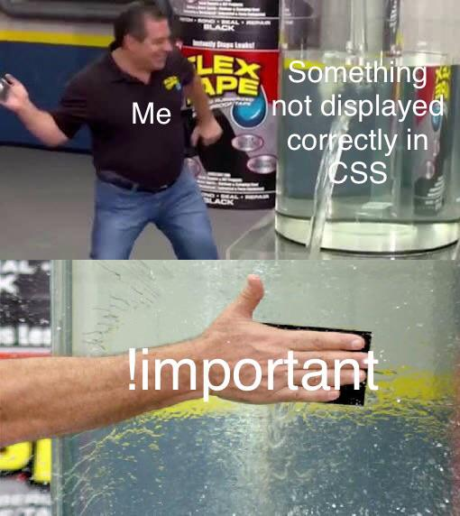
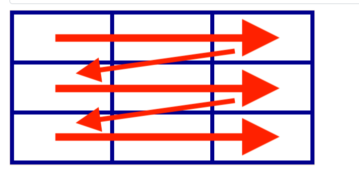
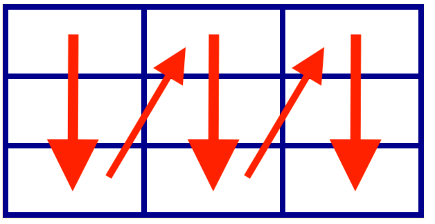
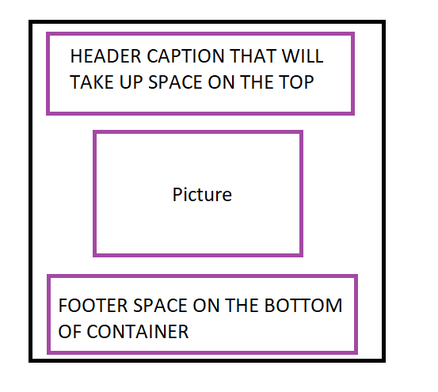
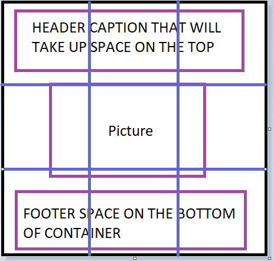

# `S1W14D4`

## `!important`



- Gives more weight to a certain property, overriding all previous styling rules for
that specific property
- Can be useful when the desire is to have an specific element look a certain way,
regardless of other stylings (utility classes)
- Should be used sparingly as it acts more like a band-aid

## [`Normalize CSS`](https://github.com/necolas/normalize.css)

- Every browser has their own default styles defined in the `user agent stylesheet`
- In order to standardize styles across browsers, a `reset.css` or `normalize.css` should
be inserted as the first stylesheet rendered

## `CSS Frameworks`

- Pre-built `CSS` libraries that include styling for UI elements
- Can be simple and lightweight or heavy-duty and opinionated
- Opinionated frameworks come with more features and functionality
  - Downside is that your app is going to look like every other app using that library

### `Popular Frameworks`

- [Bootstrap](https://getbootstrap.com/docs/5.0/getting-started/introduction/)
  - most popular CSS framework
  - dev'd by Twitter in 2011
  - 12 col grid, rounded buttons, universal style
  - also provides `JS` feature for **interactivity**
- [Pure CSS](https://purecss.io/layouts/)
  - lightweight and un-opinionated
  - dev'd by Yahoo in 2013
  - contains *purely* `CSS`, no `JS`
- [Material UI](https://materializecss.com/)
  - comprehensive design system
  - dev'd by Google
  - Highly Opinionated
  - [Material Design Docs](https://material.io/design/introduction) are great to learn the basics of design.
  - includes react components!
- [Tailwind](https://tailwindcss.com/docs/installation)
  - utility-first
  - dev'd in 2017
  - un-opinionated
  - not as robust as some others
  - highly customizable

## `Grid`

[Must watch](https://www.youtube.com/watch?v=3elGSZSWTbM)

### Flex
- If you want the layout to adapt to the content
- Small individual components
- Navbars, card layouts

### Grid
- If you want the content to adapt to the layout
- Large scale page layout
- eg calendars, newspaper-style layouts, photo collages

### Creating a grid container
- To use grid in css, you need to make a grid container.
```css
  .container{
    display: grid;
  }
```

- Next we need to define how many rows/columns our grid will have.
- use ```grid-template-columns``` and ```grid-template-rows``` to determine the size and number of our rows and columns.

```css
.container{
  display:grid;
  grid-template-columns: <size> <size>; /* <size> for however many columns you want */
  grid-template-rows: <size> <size>; /* <size> for however many rows you want */
}

```
- <size> can take absolute values like ```px``` or relative values like ```%``` or ```fr```.

- fr is a relative unit that represents the fraction of space the cell will take up relative to the size of the grid container.
IE if our grid container is 100 x 100 and is 2x2:

```css
    .container{
        display:grid;
        height: 100px;
        width: 100px;

        grid-template-columns: 1fr 1fr; /* will divide the column width evenly between the 1fr and 1fr, therefore each cell will be 50px wide each*/

        grid-template-columns: 3fr 1fr; /* the first cell has a size of 3fr while the 2nd cell has 1fr, will set the size of cell 1 to 75px wide and set the cell 2 to 25px wide */

        grid-template-rows: auto /* will match whatever we set for the column size*/
    }
```

```css
.container{
  display:grid;
  height: 100px;
  width: 100px;

  grid-template-columns: 50px 50px;
  grid-template-rows: 50px 50px;

  /* OR */

  grid-template-columns: 1fr 1fr;
  grid-template-rows: 1fr 1fr;

  /* OR */

  grid-template-columns: 50% 50%;
  grid-template-rows: 50% 50%;

/* You can even mix and match units! */

grid-template-columns: 75px 1fr; /*this will set the first col width to 75px, and 1fr will use the remaining space IE 25 pixels*/

}
```

### Organizing grid containers

#### Grid Flow
- grid containers default layout / flow is row. Items will start in the upper left then to the right till the end, then back to the left.



- using ```grid-auto-flow``` will allow us to change the flow to column. First item will still start in the upper-left then head down to the last cell, then start at the top of the next column.


#### grid-template area
- We can control where our grid items go in our grid container using ```grid-template-areas```

- Lets say we want to make a card with a header, picture, and footer. Here is a quick wire frame:



- Now if we overlay a 3x3 grid over this wireframe:



- then we can use ```grid-template-areas``` to allocate grid cells to the different components of our card.

```css
.container{
    display:grid;

    height: 600px;
    width: 600px;

    grid-template-columns: repeat(3, 1fr); /* Creating a grid container with 3 columns and 3 rows evenly sized*/
    grid-template-rows: auto;

    grid-template-areas:
    "header header header" /*first string represents first row, allocating top 3 columns to our header element*/
    ". picture ." /*second string represents second row, allocating the 2nd row middle column to our picture element. the "." represents empty space*/
    "footer footer footer"; /*third string represents thirst row, allocating bottom 3 columns to our footer element. */
}

.header{
    grid-area: header; /* sets this element as the header in our grid-template-areas */

}

.picture{
    grid-area: picture; /* sets this element as the picture in our grid-template-areas*/
}

.footer{
    grid-area: footer; /* sets this element as the footer in our grid-template-areas*/
}

```


#### justify / align items
- Similar to how we organize flexbox items we can justify and align items except its aligns/justify items within each grid cell.

- justify-items - aligns items on the row (horizontally)
    - start - aligns items with the start line of their cell (left side)
    - end - aligns items with the end line of their cell (right side)
    - center - aligns items in the center of their cell (center)
    - stretch - fills the whole width of the cell (the default value)

- align-items - aligns items on the column (vertically)
    - start - aligns items with the start line of their cell (top of cell)
    - end - aligns items with the end line of their cell (bottom of cell)
    - center - aligns items in the center of their cell (center)
    - stretch - fills the whole height of the cell (the default value)

#### gaps
- We can add gaps between our elements within our grid containers using ```gap``` if we want to set row and column gaps at the same time, or ```row-gap``` to set a gap between rows, or ```column-gap``` to set a gap between columns. Generally we would pass in pixel values.
