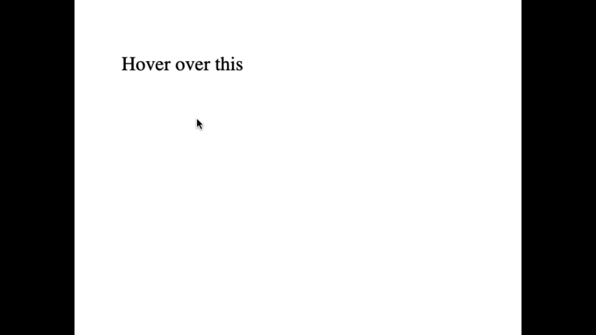

# `M3W2D4`

> ## `Helpful Links`
> [Animatable CSS Properties](https://developer.mozilla.org/en-US/docs/Web/CSS/CSS_animated_properties) <br>

## `CSS Transitions`

- Provides a way to **control animations** when changing `CSS` properties

### Defining Transitions

- controlled using *variations* of the `transition` property

<transitionproperties>

```css
/* When we add transition rules, it will apply anytime that property changes, so if we add more than just the hover event, it will apply to those too */
#delay {
  font-size: 14px;
  transition-property: font-size; /* define what we want to be affected */
  transition-duration: 4s; /* how long we want it to take to finish */
  transition-delay: 2s; /* how long we want it to wait before it starts  */ 
}

#delay:hover {
  font-size: 36px; /* transition rules will apply to this font size on hover */
}
```



## `Wireframes`

- *created by designers* to give product specs to devs.
- drawings of the layout
- usually includes
  - color and font selections
  - a navigation map
  - descriptions of how interactions should behave
  - anything else needed to define the look, feel, and operation of the app

### `Lo-Fi vs High-Fi`

- `Low-fidelity` means low truth or accuracy
  - minimal amount of guidance
  - allow for a greater degree of *interpretation* for the dev
  - often includes a separate **style guide** or **design book** to layout colors and fonts
- `High-fidelity` is the opposite of `low-fidelity`
  - produces a prototype that **looks almost exactly like the finished product**
  - takes far greater time
  - can lock the team into a look and feel much earlier in the dev process

### `Pixel Perfect`

- means what it sounds like
- designer produces a **`high-fidelity wireframe`**
- dev matches **every single thing** on the design to the `pixel`
- usually used by high-traffic sites (`facebook`, `twitter`, `google`)
- Not needed most of the time
- **However, being able to produce pixel perfect results will separate you from other junior devs**

Larger companies trend toward `high-fidelity`, while smaller companies usually use `low-fidelity`.

## `CSS Frameworks`

- pre-built `CSS` libraries that include styling for UI elements
- can be simple and lightweight or heavy-duty and opinionated
- opinionated frameworks come with more features and functionality
  - the downside is that your app is going to look like every other app using that library

### `Popular Frameworks`

- [Bootstrap](https://getbootstrap.com/docs/5.0/getting-started/introduction/)
  - most popular CSS framework
  - dev'd by Twitter in 2011
  - 12 col grid, rounded buttons, universal style
  - also provides `JS` feature for **interactivity**
- [Pure CSS](https://purecss.io/layouts/)
  - lightweight and un-opinionated
  - dev'd by Yahoo in 2013
  - contains *purely* `CSS`, no `JS`
- [Material UI](https://materializecss.com/)
  - comprehensive design system
  - dev'd by Google
  - Highly Opinionated
  - [Material Design Docs](https://material.io/design/introduction) are great to learn the basics of design.
  - includes react components!
- [Tailwind](https://tailwindcss.com/docs/installation)
  - utility-first
  - dev'd in 2017
  - un-opinionated
  - not as robust as some others
  - highly customizable

## Projects

[CSS Transitions](https://open.appacademy.io/learn/js-py---pt-may-2022-online/week-14---css/practice--css-transitions) (30m)

- Walkthru transitions

[CSS Framework](https://open.appacademy.io/learn/js-py---pt-may-2022-online/week-14---css/css-framework-long-practice) (until EOD)

> If you finish early, please either go back and finish the AA Times project from yesterday, replay the Flexbox or Grid games, or just work on anything you feel you need more practice with! There will not be an EOD today!
