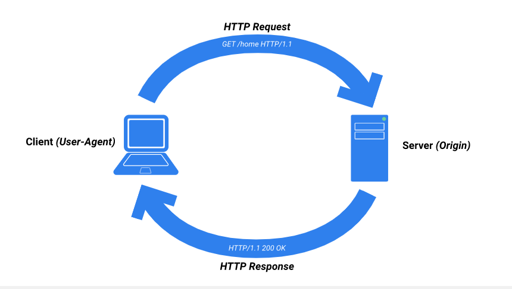
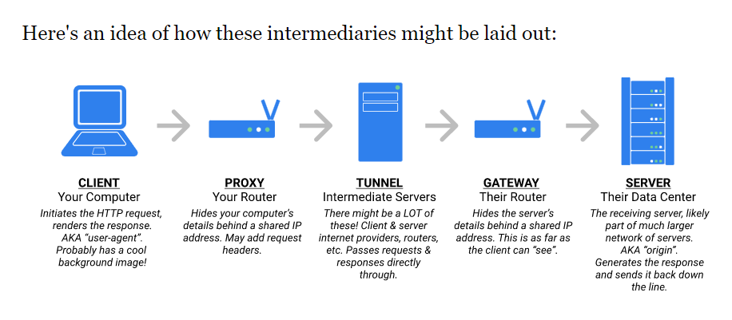
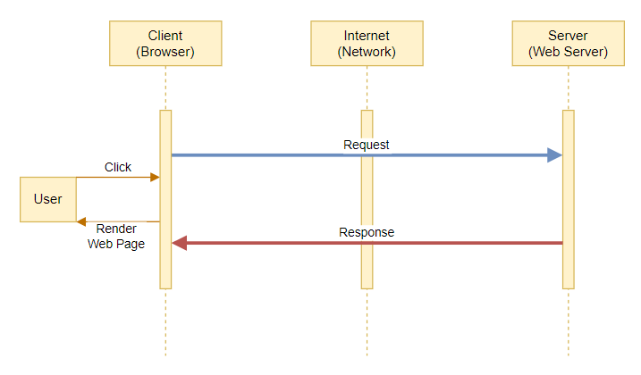

## **`Welcome to Week 3`**

> ## Helpful Links  
> [The HTTP Spec](https://www.rfc-editor.org/rfc/rfc2616#section-1.4)

This week we will be learning about `HTTP`, `REST`, and `Servers`!

- **`HTTP`**: A protocol for fetching resources. The foundation of any data exchange on the web.
- **`REST`**: Acronym for Representational State Transfer - is a ruleset that defines best practices for sharing data between clients and the server.
- **`Server`**: Hardware or software that takes client `requests` for data and sends `responses` back with that data.

## `Servers`

First lets clear up what `Full-Stack` means. A `full-stack` app is an app that has both a `frontend` and a `backend`.

- **`Frontend`** (**User Interface**)
  - The part that the client sees and interacts with, the stuff on the page
  - Will use `HTML`/`CSS`, `Javascript`, `React`

- **`Backend`** (**The Server**)
  - The part that's working behind the scenes to make sure the data our page needs is available and sending it in a `response` when a `request` is made
  - Will use `Javascript`/`Expressjs`/`Sequelize`, `Python`/`Flask`

## `HTTP`

- HT: `HyperText`: Content with references to other content (`HTML`: HyperText Markup Language)
- TP: `TransferProtocol`: Defines the expectations for both ends of the transfer - the **`request/response protocol`**

  - Works between `clients` and `servers`
  - `requests` are sent from the `client`
  - `servers` recieve the `request`, `fetch` the needed data, and send a `response` back with that data

   
  

### `Properties of HTTP`

- **Reliable Connections**: sacrifice speed for reliability
- **Stateless Transfer**: doesn't store any information
- **Intermediaries**: other servers that pass your request along to the correct place, there are 3 types:
  - **`proxy`**: may modify your request so it appears to come from a different place
  - **`gateway`**: pretends to be the resource server
  - **`tunnel`**: simply passes the request along

 

## `Request/Response Cycle`

 

The browser parses `HTML`, `CSS`, and `JS`, then renders that info to the user by constructing and rendering as a [DOM tree](https://developer.mozilla.org/en-US/docs/Web/API/Document_Object_Model).

## `Quiz`

[Server and HTTP Quiz](https://open.appacademy.io/learn/js-py---pt-may-2022-online/week-15---http--rest--and-servers/server-and-http-mc-quiz)

## `Homework`

> Please follow along with the guided practice for today, and do your homework for Tuesday. **If you did not [download postman](https://open.appacademy.io/learn/js-py---pt-may-2022-online/week-14---css/download-postman) last week, please do so NOW**.
