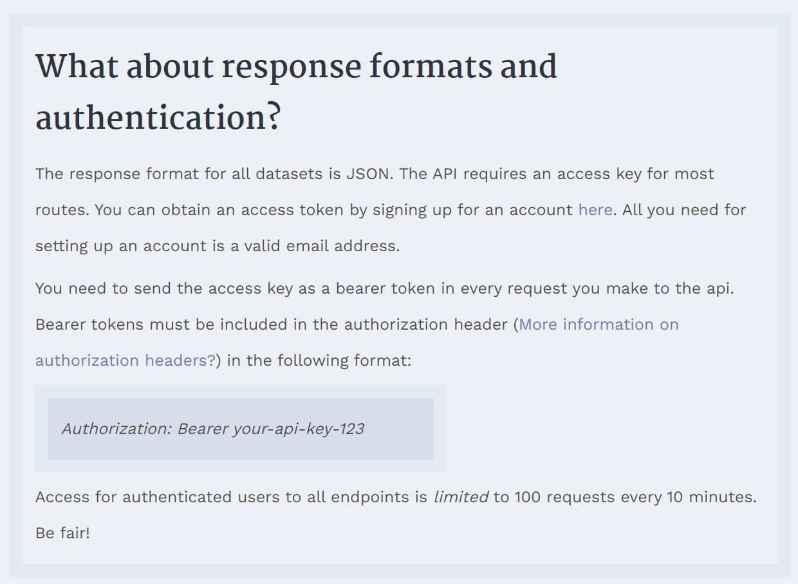
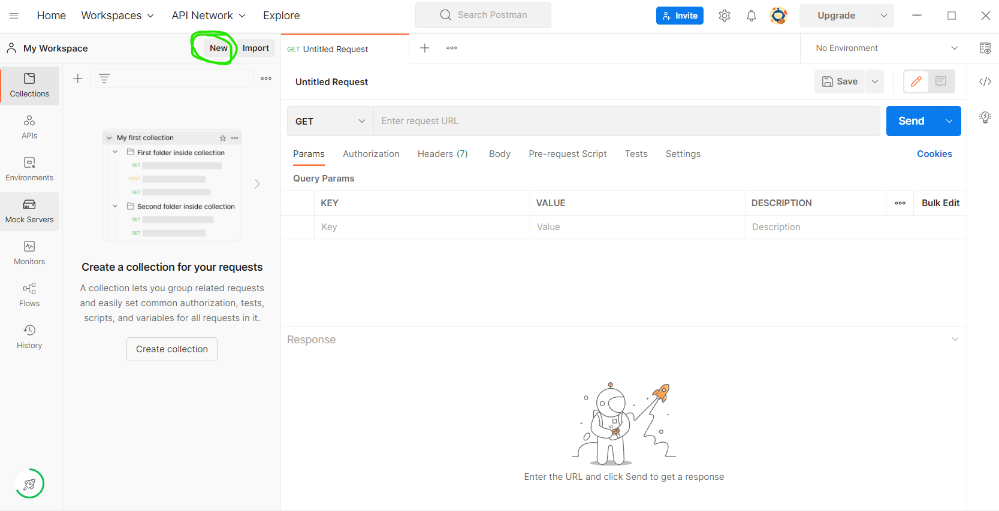
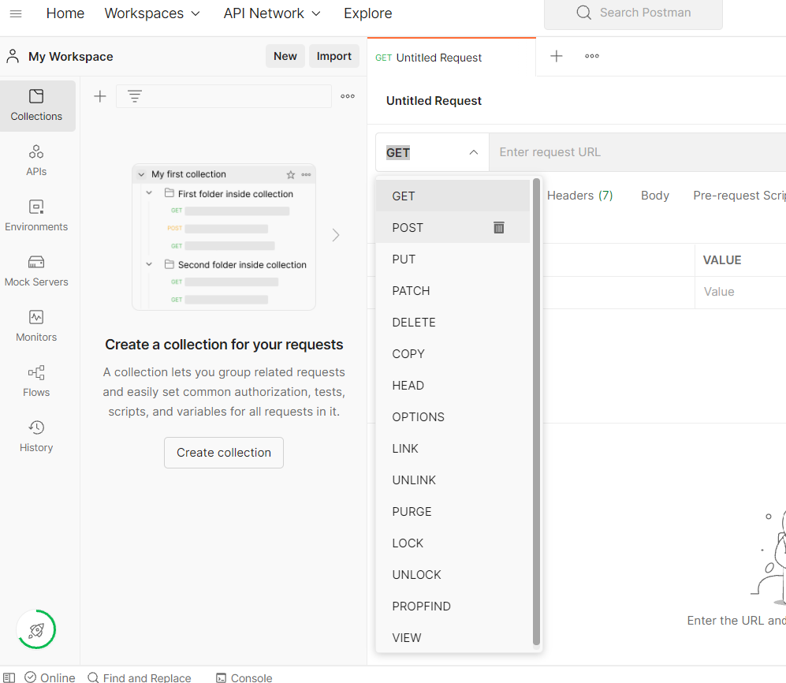
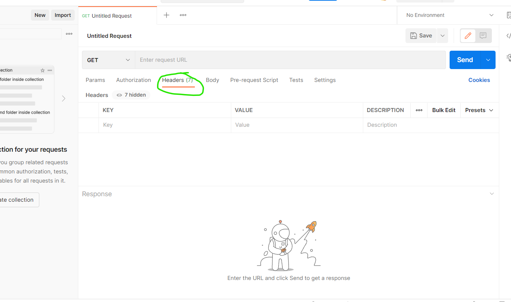
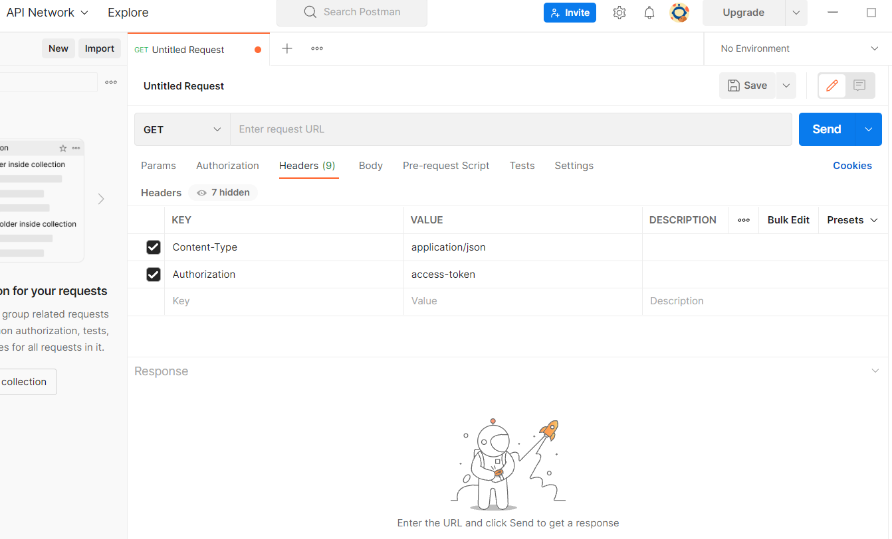
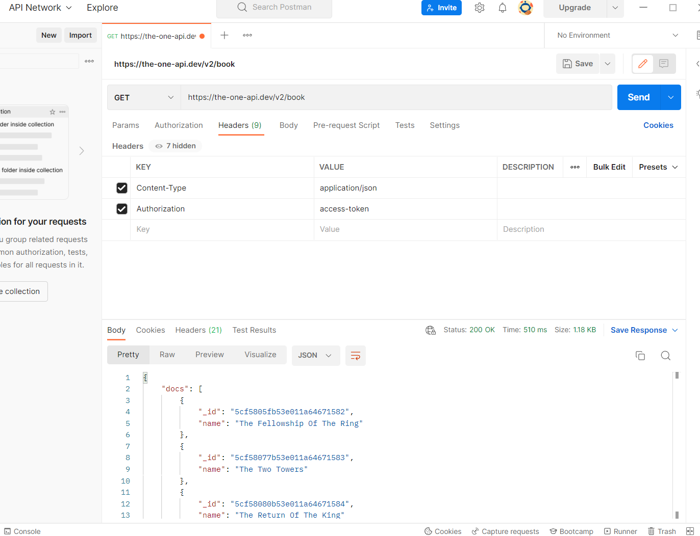

# `Postman Demo`

## `One API To Rule Them All`

In the spirit of the new `LOTR` series on Amazon Prime, I thought we'd use this `API` to demo how `postman` works. This `API` is very beginner friendly, and I would suggest reading through the docs and learning more about REST `APIs` while you're there!

- First please head over to [the-one-api.dev](https://the-one-api.dev/) and signup. You only have to give your email and create a password.
- Once you create an account *`copy your access token`* and paste it somewhere to keep it handy.

After you have signed up and you have your access token, please go to the [API docs](https://the-one-api.dev/documentation). Here, there is a little more information about what we need in order to make requests. At the top of the page there is some great information to help you learn about REST APIs.

The first paragraph with essential information is the fourth from the top.

- Here we learn that the response will come back as `JSON`. `Application/JSON` is the most common `Content-Type` I've seen used.
- We also learn that we are going to need an *`Authorization`* header, and that is where we will need to paste our `access token`.

The next box beneath this one holds the available `endpoints`. This API is only for `GET` requests.

> All `endpoints` must be prefixed with **`https://the-one-api.dev/v2`**

---

## `Postman`

Open `Postman`. To begin it should look something like this. If you don't see the option to send a request, click the `New` button that's been circled below and select `HTTP Request`.

Once you have a request open, You'll see an input for a url and on the left is a dropdown. If you click that you will see all of the `methods` that are available to use. We will only be using `GET` for this demo.

The first thing we have to do before we can make a request is set up our **`request headers`**. Navigate to the `Headers` tab. You may see many `headers` already there, if they are hidden there is a button you can click to show them. **DO NOT ALTER THESE**. These are the default `headers` postman has determined neccessary to make requests.

Here we want to add 2 new `headers`.

- First add your `Content-Type`
- Then add your `access token` with its appropriate header

It should look like this once completed, but with your values filled in.

Once you have done that, Look over the API docs, choose an `endpoint` and start making requests!

- To begin lets make a request to `/book`

We can see that the `/book` `endpoint` returns a list of all of the LOTR books. I would have personally named it books plural, but either way is fine. If it went through properly you should see something like this.

- Now grab the `ID` of one of the books, and find the `endpoint` to make a request for a single book using the `ReSTful` convention!

You should see only one book in your content box below.

- Next lets grab a list of all the characters in the books

This list is in alphabetical order and includes *every character*. We don't care about the extras right now, so lets grab our favorite character. Scroll down and read the docs to find out how to filter our request for a specific character. Choose your favorite, or use the given example in the docs.

- Next grab all the available quotes for that character

- This list is super long. Filter it to only include the first 10 quotes.

Great job. You now know the basics of `Postman` and making basic `GET` requests to an `API`.
