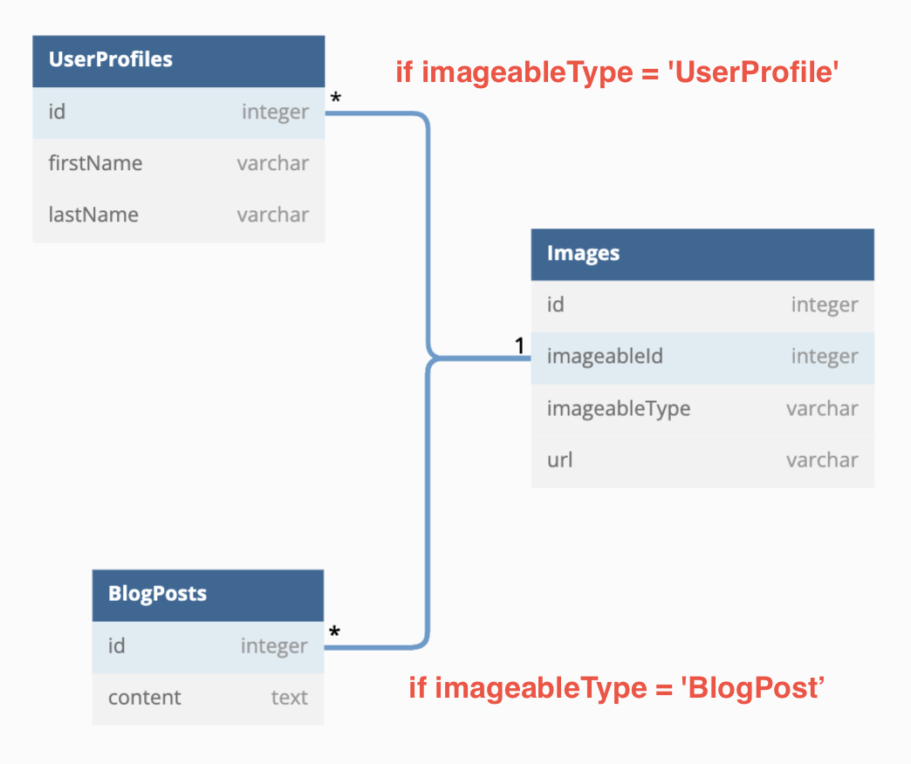

## UserProfile Model
```javaScript
class UserProfile extends Model {
  associate(models) {
    UserProfile.hasMany(models.Image, {
      foreignKey: 'imageableId',
      constraints: false,
      scope: {
        imageableType: 'UserProfile'
      }
    });
  }
}
```
## BlogPost Model
```javaScript
class BlogPost extends Model {
  associate(models) {
    BlogPost.hasMany(models.Image, {
      foreignKey: 'imageableId',
      constraints: false,
      scope: {
        imageableType: 'BlogPost'
      }
    });
  }
}
```
## Image Model
```javaScript
class Image extends Model {
  getImageable(options) {
    if (!this.imageableType) return Promise.resolve(null);

    const methodName = `get${this.imageableType}`;
    return this[methodName](options); //image.getUserProfiles(options) || image.getBlogPosts(options)
  }
  associate(models) {
    Image.belongsTo(models.UserProfile, {
      foreignKey: 'imageableId',
      constraints: false
    });
    Image.belongsTo(models.BlogPost, {
      foreignKey: 'imageableId',
      constraints: false
    });
  }
}
```

