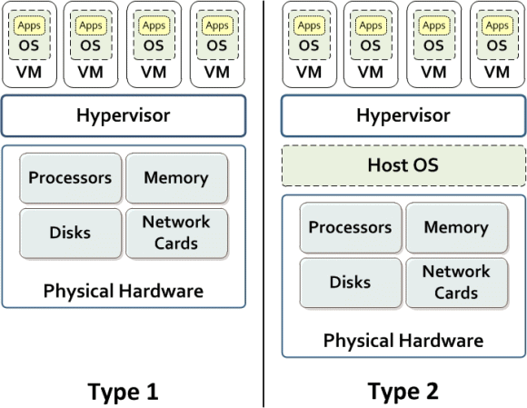
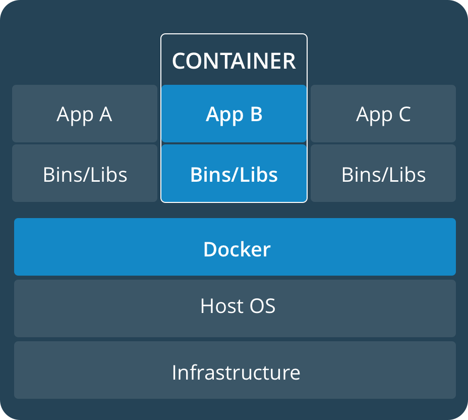

# Docker and Containers

## VMs vs Containers

- Virtual Machines contain a complete OS + apps
  - Has its own kernel
  - utilize hypervisors to interact with hardware

## Hypervisors

- Two types of hypervisors: *Bare metal* and *Hosted* hypervisors
  - Bare metal:
    - installed directly on top of the underlying machine's hardware
    - directly interacts with hardware
    - faster, simpler, and more stable than hosted hypervisors
  - Hosted:
    - installed on top of the host OS
    - translates the guest operating system’s calls into the host operating system’s calls

## Containers

- allow a developer to package up an application with all of the parts it needs, such as libraries and other dependencies, and ship it all out in one pretty package
- run directly within the host machine’s kernel
  - all the system calls and kernel functionality comes from the underlying host OS
  - draw back is that this opens up a whole variety of vulnerabilities
- Super lightweight
- Quick boot time with no need to start up a kernel

Not an either/or proposition between VMs and containers, you often see Docker containers running inside virtual machines in a production environment

## Docker

Used to create Linux and Windows containers.

Every container is built upon an *image*

- A Docker image is a collection of dependencies that an app needs to run
- An image is specified in a *Dockerfile*
  - That *Dockerfile* will install dependencies, create data stores, and ensure that the development environment is configured correctly
- [Docker Hub](https://hub.docker.com/) is a registry of Docker images, and is very often the start of the Docker workflow.

## Linux

Many distributions of Linux, including:

- Alpine
- Debian
- CentOS
- Fedora
- Red Hat
- Ubuntu

Common Linux commands:

- `ls` - lists the files in a folder
- `cd` - change directory
- `pwd` - prints the present working directory
- `echo` - prints the value of a variable
- `ps` - prints running processes
- `less` or `more` - display long outputs in the terminal
- `|` - used to chain commands together where the output from one is sent to the next
- `>` - creates or replaces the contents of the output file
- `>>` - appends to the output file

### Package Managers

- `apt` - the Advance Package Tool is used by Debian and Ubuntu
- `yum` - the Yellowdog Updater Modified is used on Red Hat
- `apk` - the Alpine Package Keeper used by Alpine Linux
