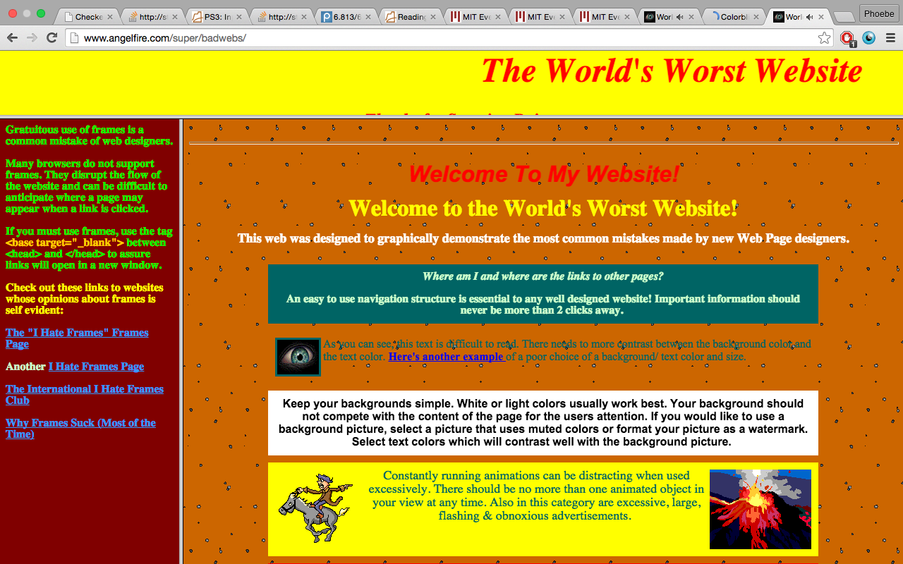
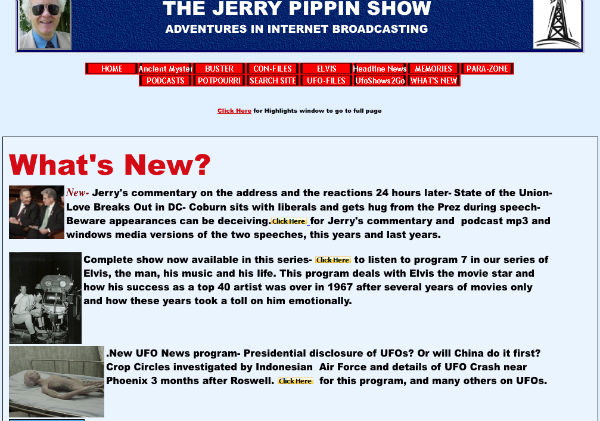
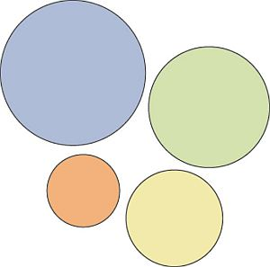
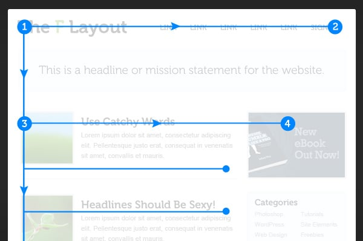
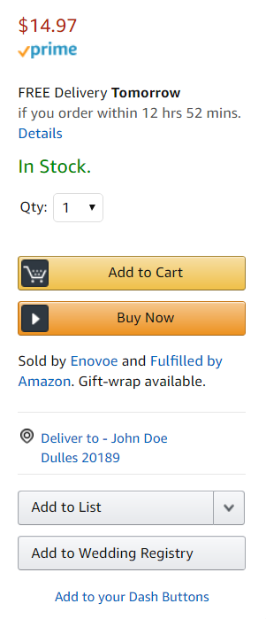
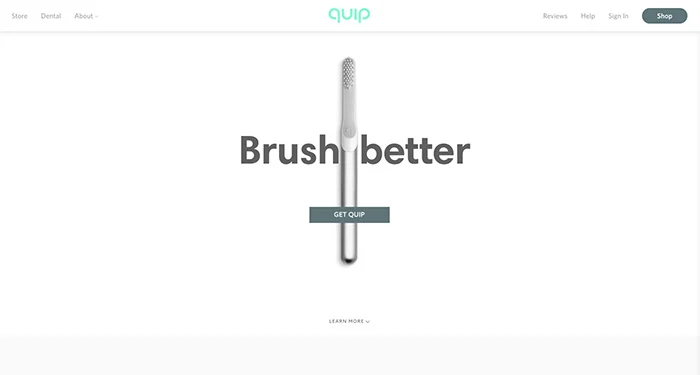
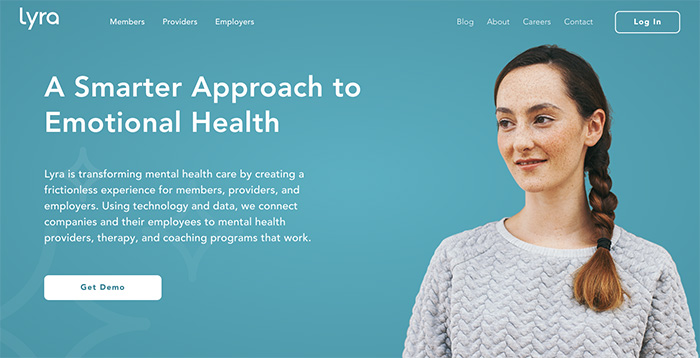
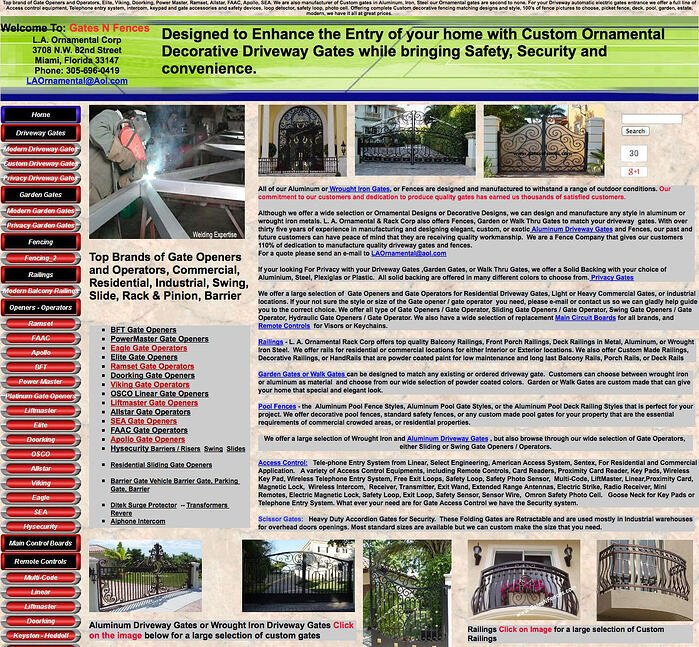
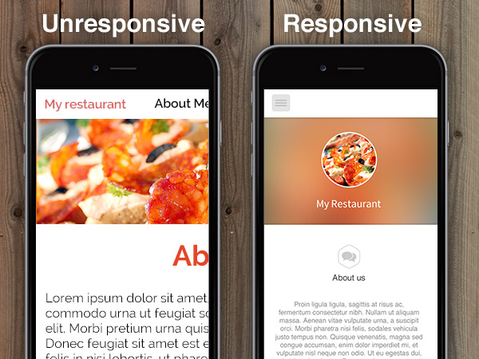

# UI Design Principles

## Simplicity

### Color

Color selection should be limited, less than 5 colors on the entire site. A lot
of modern web design uses a single accent color, with a black and white
aesthetic

If you struggle to understand color theory and what sorts of colors go nicely
together (I definitely do), there are tons of websites out there that will
generate a color pallette and you can just search for one that you like.
[for example](https://coolors.co/)

### Typography

Typefaces should legible (no weird fancy fonts) and should be limited, a max of
three fonts on the entire site. One for headings, one for body text, and one for
accents.

---

## Navigation

Navigtion is the primary way users interact with your site, it needs to be
simple, intuitive, and consistent. If you go to almost any sucessful website you
will see very little variation on how the site manages navigation. People who
use the internet with any level of consistency have a built in understanding of
how website navigation works and will feel confused and annoyed by anything that
moves away from their expectations. Navigation is intended to be just a tool
that provides easy interaction for the user, it doesn't need to be fancy, it
needs to be useful.

A general rule is that nothing should take more than three clicks to get to on
your entire site.

One method to help you reduce the complexity of your navigation is to write out
instructions on how to do each action on your site. If you struggle to write the
instructions or the instructions are too complicated, consider rethinking how
your navigation is functioning.

---

## Visual Heirarchy

An important consideration when designing the layout of a page is to consider
how to point the users eyes towards the most important information and in the
correct order.

There are several ways of achieving this but the two most important are sizing
and layout.

### Sizing

Important things should be bigger than less important things.

Content that should be viewed first should be larger than content that should be
viewed later.

This is the concept behind a header being a larger font than a paragraph.

### Layout

Researchers have found that an F shaped layout guides the user most naturally
through a pages content. This means the easiest layout to understand and follow (at least for western audiences)
is to make a page follow the same format as a book. Left to Right, Top to
Bottom

### Color also helps

---

## Whitespace

Whitespace is your friend. Whitespace is the empty space around design elements and blocks of text. The space doesn't have to be white. It could be the color of the background of your page. Many people make the mistake of cramming every pixel of their page with text or an image. But you're better off giving elements space to breathe.

Using blank space minimizes noise, helps images stand out, and makes content
more digestible.

---

## Mobile Friendly Design

Making sure a website is mobile friendly can be super annoying, but is the
reality of modern web design. Mobile web browsing makes up a massive percent of
how people access your website and if the mobile browsing experience is terrible
than most people wont come back.

A common idea is web design is to design for mobile devices first and then add
media queries to change the layout for larger screens, rather than designing for
full size screens and then changing the layout for mobile browsing.

---

## Atomic Design ([reference](https://atomicdesign.bradfrost.com/chapter-2/))

It can be helpful to have a structure or methodology to inform your design
decisions and to organize your process. The atomic design methodology is a great
way to help with that, in particular when working with something like react that
already breaks up content into components.

### Atoms

Atoms are the basic building blocks of the universe, similarly they can be the
basic building blocks of your web design. A label, an input, a button, things
that cant be broken down any smaller and still be functional. What
styles are you applying to those base elements?

### Molecules

Molecules are groups of atoms that form a meaningful cluster that serve a single
purpose. What styles can be applied to a group of atoms to provide a meaningful
base component, the simplest structure larger than a single atom.

### Organisms

Organisms are a standalone portion of your interface, a collection of molecules.

### Templates

Templates are a collection of organisms, ready to be filled with content, but
not the actual content

### Pages

Pages are a template that has been filled with actual content, you take a
template and inject data into it to produce a page.

---
