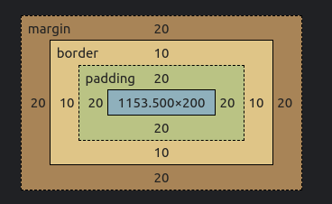

# CSS Box Model

Every element in css has a box around it.

## Block vs Inline Block

### Block Boxes

The box will break onto a new line.

The width and height properties are respected.

Padding, margin and border will cause other elements to be pushed away from the
box.

The box will extend in the inline direction to fill the space available in its container. In most cases, the box will become as wide as its container, filling up 100% of the space available.

### Inline Boxes

The box will not break onto a new line.

The width and height properties will not apply.

Vertical padding, margins, and borders will apply but will not cause other inline boxes to move away from the box.

Horizontal padding, margins, and borders will apply and will cause other inline
boxes to move away from the box.

## Box vs Border Box

