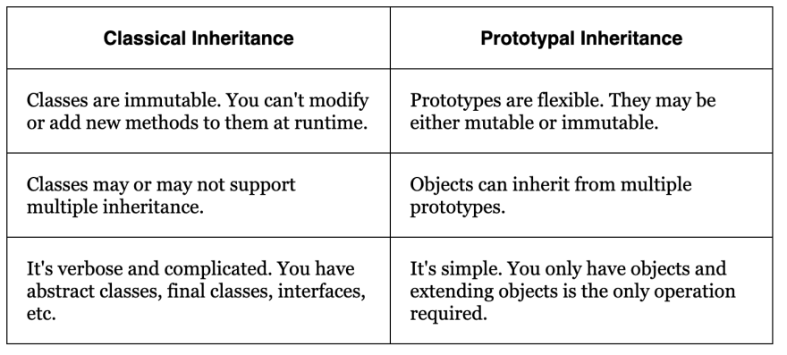
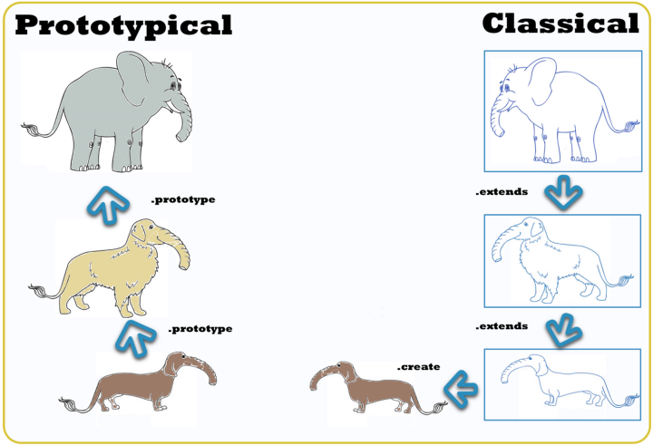

# Prototypal Inheritance

A critical aspect of understanding JavaScript is understanding how prototypical
inheritance works. It also happens to be a common interview question topic, which
makes it a pretty important aspect of the language to understand, at least on a
basic level.

## Object Orientation

Objects are abstractions of physical things and Object Orientation is to mimic
these real world categories as much as possible.

```js
class Cat {
  constructor(name, color){
    this.name = name;
    this.color = color;
  }

  meow(){
    return `${this.name} says meow!`
  }

  describe(){
    return `${this.name} is a ${this.color} cat`
  }
}
```

### Classical Inheritance

In classical inheritance, objects are a generalization of a real world thing and
classes are a generalization of an object. Each Child class is one further
abstraction or generalization away from the real world thing. In Object Oriented
Languages Classes are not just objects, this is an important thing to notice.

```js
// Cat Object
{
  name: "Juice",
  color: "Black"
}

// Cat Class
class Cat {
  constructor(name, color){
    this.name = name;
    this.color = color;
  }
}

class OrangeCat extends Cat {
  constructor(name){
    super(name, "orange")
  }
}
```

### Protypical Inheritance

In prototypal inheritance you do not deal with further increasing levels of
abstraction, everything is either a direct abstraction of a real world thing or
a direct copy of another object (a prototype).

```js
const cat = {name: "juice", color: "black"};
const blackCat = Object.create(cat)
```

## Advantages of Prototypal Inheritance




## How does it work?

### The new keyword

[MDN-Reference](https://developer.mozilla.org/en-US/docs/Web/JavaScript/Reference/Operators/new)

1. Create a blank new object.
2. Point the new objects prototype to the constructor functions prototype
   property if the prototype is an object, otherwise the new object stays as a
   plain object setting its prototype to Object.prototype (the default Object
   prototype in JS).
3. Execute the constructor function with the given arguments, binding `this` to
   the newly created object.
4. Returns the newly created Object.
