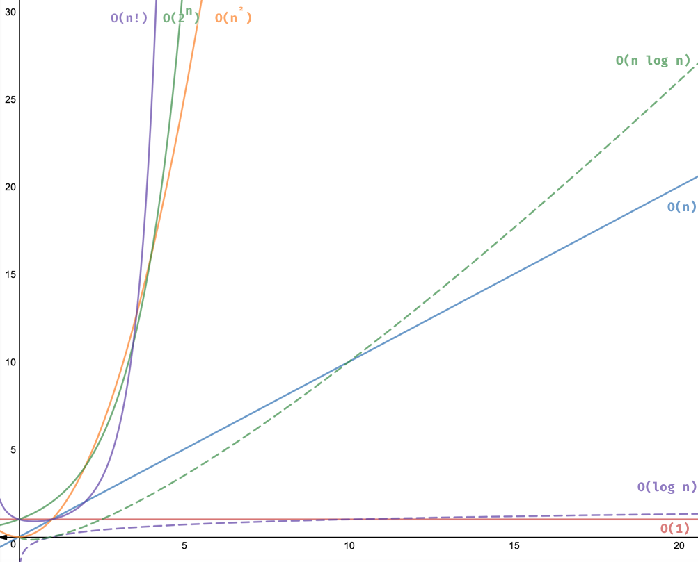

# M2WHolidayD2

## What is a tree?

- Still just a collection of nodes.
- Tree's like linked lists are a widely used abstract data type. While linked
lists contain linear data, trees store hierarchical data.
- Linked lists have a `next` and `prev` property while trees have a `parent`
and `children` property representing the hierarchical nature of the tree.

## Where do we use trees?

- Your computer's file system
- Reperesenting a hierarchical organization chart(Manager/employee relationship)
- Family Tree
- Decision Tree

## Tree Terminology

- Node: A tree component that contains one value and pointers to other nodes
- Root node: The top node in a tree
- Edge: Another name for a pointer
- Parent/child node: A parent node points to child nodes
- Neighbor: Either a parent or child node
- Subtree: A tree whose root is the child of another node in the tree
- Branch node: A node with at least one child node
- Leaf node: A node with no children
- Level: The number of edges between a given node and the root node
- Width: The number of nodes in a given level
- Height: The number of edges between the root node and the bottom-most node

## Decision Tree

### Should I go Running?


## Decision Tree exercise (10 min)

Use google draw to make a simple thanksgiving decision tree. Potential ideas:

- How to cook a Turkey?
- How to set the table?
- What to have for desert?

## Logarithmic Time

- Logarithmic time means that as the input size grows the amount of operations
needed to search grows much slower.
- Logarithmic algorithms usually divide the problems in half every time


## Properties of Binary Search Trees

- The tree starts at the root
- nodes whose values are less than the current node go to the left
- nodes whose values are more than the current node go to the right
- Each node has three properties: value, left and right

## Create a Binary Search Tree Exercise

```js
[14, 7, 17, 5, 8, 16, 18]
Bonus: [8, 3, 1, 2, 4, 6, 5, 12, 4]
```
